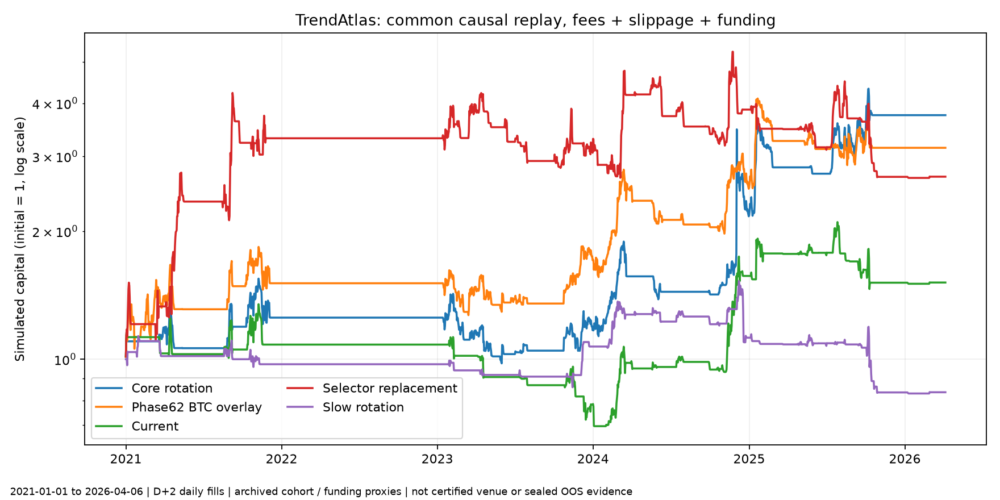

# TrendAtlas — strategy archaeology a spoločný causal replay

**Verdikt: REPLACE_STRATEGY.** Súčasná stratégia ani obidve výmeny selectora neprešli vopred určenými limitmi drawdownu a ziskových foldov. Toto je verdikt pre ďalší výskum architektúry; žiadna otestovaná náhrada tu nie je potvrdená na nasadenie.

Súčasná stratégia: CAGR **8.20%**, intradenný MDD **−53.36%**, Sharpe **0.41**, ziskové foldy **3/6**. Pri 2× nákladoch a rovnakých signáloch CAGR **0.35%**, po vynechaní troch najlepších celých obchodov **-4.61%**.

Všetky výsledky boli vypočítané odznova z kódu a zmrazených OHLC/ETF/makro vstupov. Staré paper returns, snapshot equity ani uložené súhrnné metriky nie sú vstupom do rozhodnutí ani PnL.

## Rozsah a presnosť záveru

Spoločné testovanie: **1. 1. 2021 – 6. 4. 2026**, päť celých ročných foldov a čiastočný rok 2026. Rovnaké hranice, účtované výstupy na konci roka, nulový úrok CASH, žiadny nový parameter search. Train/validation hranice sú v contract.json; zdrojové online týždenné governance používajú iba už dokončenú minulosť. Ide o chronologické výpočtové OOS na už skúmanej histórii, nie o nový nedotknutý holdout.

Spoločný panel má 19 aktív a prijatie až po 260 dokončených kladných OHLCV pozorovaniach. BCH/ICP/XTZ končia 6. 4. 2026, preto celý spoločný test končí v tento deň. Modelové masky univerza sú explicitné experimentálne vrstvy. Kompletný historický zoznam delistovaných coinov, makro vintages a pôvodné časy publikácie/revízie ETF chýbajú. **Plná point-in-time platnosť historického trhu zostáva NEOVERENÁ.** Prefix/future-mutation testy overujú kauzalitu výpočtu na zachytených dátach, túto medzeru neodstraňujú.

Plnenie: signál z close D, dostupnosť predpokladaná až D+1 00:00:01 UTC, preto fill pri D+2 open; 4.5 bp fee, 10 bp nepriaznivý sklz na každom fillovanom notionali, 12% p.a. funding debit na celom držanom notionali. Spot OHLC sú cenový proxy pre lineárnu expozíciu; nejde o overené historické perp/listing/order-book/funding dáta konkrétnej burzy. Margin crossing a náklady likvidácie sa simulujú. Všetky modely vrátane vnútorných shadow portfólií používajú ten istý engine. Denné sizing/rebalancing konvencie sú harmonizované, nie prevzaté z chybných paper účtovaní.

## Jedna spoločná tabuľka

CAGR, MDD, náklady a stresy sú v %. MDD je záporná strata z konzervatívnej intradennej OHLC cesty, nie iba close-to-close. Turnover je × NAV/rok vrátane oboch rotačných strán. Náklady sú ročný súčet debitov/pre-charge NAV, nie zložený rozdiel CAGR. Obchod je úplná rovnaká aktívová epizóda; resizing ju nedelí. Držanie je v dňoch. Ziskový fold má výnos striktne >0. Tri posledné stresové stĺpce uvádzajú CAGR.

| Stratégia / ablation | CAGR | MDD | Sharpe | Calmar | Turnover | Náklady | Obchody | Medián držania | Ziskové foldy | Najhorší fold | 2× náklady | Bez naj dňa | Bez top3 obchodov |
|---|---:|---:|---:|---:|---:|---:|---:|---:|---:|---:|---:|---:|---:|
| phase61_core_rotation | 28.54 | -50.86 | 0.67 | 0.56 | 46.37 | 10.50 | 122 | 3.0 | 3/6 | -6.58 | 15.72 | 13.10 | 6.62 |
| phase62_btc_overlay_default | 24.30 | -38.16 | 0.76 | 0.64 | 39.17 | 10.30 | 103 | 3.0 | 4/6 | 0.00 | 12.12 | 20.19 | 6.19 |
| phase63_btc_participation | 25.32 | -50.86 | 0.62 | 0.50 | 47.14 | 11.15 | 124 | 3.0 | 3/6 | -8.58 | 12.08 | 10.27 | 3.94 |
| phase66g_production_soft_filters | 20.28 | -50.86 | 0.55 | 0.40 | 48.66 | 11.42 | 128 | 3.0 | 3/6 | -20.73 | 7.29 | 5.83 | -0.23 |
| phase67j_no_neo_main | 19.27 | -50.86 | 0.54 | 0.38 | 49.42 | 11.53 | 130 | 3.0 | 3/6 | -7.10 | 6.26 | 4.94 | -1.07 |
| phase68g_66g_1p25x_candidate | 9.55 | -52.91 | 0.45 | 0.18 | 32.98 | 6.66 | 73 | 2.0 | 2/6 | -26.60 | 2.50 | 5.18 | -3.42 |
| phase68g_66g_1p50x_candidate | 9.31 | -61.24 | 0.43 | 0.15 | 38.32 | 7.74 | 73 | 2.0 | 2/6 | -31.20 | 1.16 | 4.20 | -5.72 |
| phase68g_btc_persistence_10d_early_risk_075 | 9.79 | -53.36 | 0.45 | 0.18 | 33.57 | 6.90 | 75 | 2.0 | 2/6 | -27.75 | 2.47 | 5.41 | -3.21 |
| phase68g_etf_flow_impulse_early_risk_cooldown_15 | 8.20 | -53.36 | 0.41 | 0.15 | 36.46 | 7.53 | 90 | 2.0 | 3/6 | -27.75 | 0.35 | 3.89 | -4.61 |
| phase68h_dynamic_leverage_ladder | 8.23 | -61.78 | 0.40 | 0.13 | 36.55 | 7.43 | 73 | 2.0 | 1/6 | -28.83 | 0.48 | 3.91 | -5.98 |
| phase68j_phase68g_66g_1p25x_candidate_g1_adverse_cd2 | 8.97 | -53.14 | 0.43 | 0.17 | 32.89 | 6.63 | 73 | 2.0 | 2/6 | -26.47 | 1.98 | 4.62 | -3.93 |
| phase68j_phase68g_66g_1p25x_candidate_g2_dd5_cd3 | 10.26 | -53.18 | 0.47 | 0.19 | 32.78 | 6.61 | 73 | 2.0 | 2/6 | -25.25 | 3.20 | 5.86 | -2.80 |
| phase68j_phase68g_66g_1p50x_candidate_g1_adverse_cd2 | 7.23 | -64.23 | 0.37 | 0.11 | 38.49 | 7.71 | 73 | 2.0 | 1/6 | -30.96 | -0.74 | 2.21 | -7.52 |
| phase68j_phase68g_66g_1p50x_candidate_g2_dd5_cd3 | 11.76 | -61.02 | 0.49 | 0.19 | 37.71 | 7.60 | 73 | 2.0 | 2/6 | -28.38 | 3.57 | 6.53 | -3.61 |
| phase68j_phase68h_dynamic_leverage_ladder_g1_adverse_cd2 | 6.06 | -64.73 | 0.34 | 0.09 | 36.72 | 7.40 | 73 | 2.0 | 1/6 | -28.58 | -1.51 | 1.83 | -7.86 |
| phase68j_phase68h_dynamic_leverage_ladder_g2_dd5_cd3 | 10.26 | -61.56 | 0.46 | 0.17 | 35.96 | 7.29 | 73 | 2.0 | 2/6 | -27.27 | 2.51 | 5.86 | -4.21 |
| A_selector | 28.54 | -50.86 | 0.67 | 0.56 | 46.37 | 10.50 | 122 | 3.0 | 3/6 | -6.58 | 15.72 | 13.10 | 6.62 |
| B_permission | 7.86 | -50.86 | 0.34 | 0.15 | 32.30 | 6.44 | 85 | 2.0 | 3/6 | -29.11 | 1.12 | -5.09 | -8.49 |
| C1_soft_governance_only | 7.65 | -50.86 | 0.33 | 0.15 | 32.68 | 6.50 | 86 | 2.0 | 3/6 | -29.84 | 0.87 | -5.28 | -8.67 |
| C_soft_filters | 22.13 | -43.85 | 0.80 | 0.50 | 28.50 | 5.69 | 75 | 2.0 | 3/6 | -0.51 | 15.38 | 17.04 | 6.74 |
| D_pruning | 9.44 | -47.10 | 0.47 | 0.20 | 27.74 | 5.58 | 73 | 2.0 | 2/6 | -21.86 | 3.49 | 5.86 | -1.33 |
| E_exposure_125 | 9.55 | -52.91 | 0.45 | 0.18 | 32.98 | 6.66 | 73 | 2.0 | 2/6 | -26.60 | 2.50 | 5.18 | -3.42 |
| E_persistence_bridge | 9.79 | -53.36 | 0.45 | 0.18 | 33.57 | 6.90 | 75 | 2.0 | 2/6 | -27.75 | 2.47 | 5.41 | -3.21 |
| F_ETF_no_cooldown | 9.43 | -53.36 | 0.44 | 0.18 | 38.01 | 7.90 | 98 | 2.0 | 3/6 | -27.75 | 1.11 | 5.06 | -3.53 |
| G_current | 8.20 | -53.36 | 0.41 | 0.15 | 36.46 | 7.53 | 90 | 2.0 | 3/6 | -27.75 | 0.35 | 3.89 | -4.61 |
| H_replace_selector | 20.66 | -62.03 | 0.62 | 0.33 | 58.92 | 12.23 | 138 | 2.0 | 3/6 | -30.53 | 6.76 | 15.20 | -3.96 |
| I_slow_hysteresis | -3.35 | -57.14 | -0.07 | -0.06 | 20.50 | 4.37 | 62 | 3.0 | 3/6 | -25.65 | -7.49 | -4.92 | -10.91 |
| phase2_vol_adjusted | -0.07 | -63.65 | 0.17 | -0.00 | 14.21 | 6.34 | 43 | 30.0 | 4/6 | -34.96 | -6.21 | -2.62 | -11.40 |
| phase2_regime_allocation | 9.21 | -45.76 | 0.43 | 0.20 | 10.23 | 5.05 | 26 | 30.0 | 2/6 | -19.30 | 3.83 | 5.65 | -11.76 |
| phase2_slow_hysteresis | 2.59 | -63.29 | 0.25 | 0.04 | 13.48 | 5.71 | 40 | 30.0 | 3/6 | -37.54 | -3.10 | -0.76 | -18.20 |
| phase2_ensemble | -1.04 | -60.33 | 0.15 | -0.02 | 16.11 | 6.17 | 56 | 30.0 | 2/6 | -37.82 | -6.96 | -3.38 | -18.32 |
| BTC_hold | 4.22 | -80.39 | 0.36 | 0.05 | 2.40 | 12.35 | 6 | 365.0 | 3/6 | -68.36 | -7.92 | 0.75 | -26.43 |
| BTC_SMA200 | 9.28 | -60.04 | 0.42 | 0.15 | 10.70 | 8.51 | 28 | 4.5 | 2/6 | -24.46 | 0.34 | 5.64 | -9.01 |
| S_core_unpruned | 20.05 | -50.86 | 0.55 | 0.39 | 49.42 | 11.53 | 130 | 3.0 | 3/6 | -21.53 | 6.96 | 5.63 | -0.43 |
| S_reference_before_NEO_pruning | 17.37 | -50.86 | 0.51 | 0.34 | 49.42 | 11.53 | 130 | 3.0 | 3/6 | -14.47 | 4.57 | 3.27 | -2.65 |
| S_NEO_only_not_pruned | 9.44 | -47.10 | 0.47 | 0.20 | 27.74 | 5.58 | 73 | 2.0 | 2/6 | -21.86 | 3.49 | 5.86 | -1.33 |
| S_SSOT_shortlist_current | 9.80 | -52.82 | 0.45 | 0.19 | 37.22 | 7.64 | 92 | 2.0 | 3/6 | -21.95 | 1.72 | 5.42 | -3.20 |
| S_economic_route_current | 3.31 | -58.23 | 0.27 | 0.06 | 40.45 | 8.28 | 104 | 2.0 | 3/6 | -32.96 | -4.91 | -9.10 | -11.85 |
| S_ETF_extra_day | 7.64 | -53.36 | 0.39 | 0.14 | 35.88 | 7.41 | 87 | 2.0 | 3/6 | -27.75 | -0.05 | 3.34 | -5.11 |
| S_current_without_ETF | 9.79 | -53.36 | 0.45 | 0.18 | 33.57 | 6.90 | 75 | 2.0 | 2/6 | -27.75 | 2.47 | 5.41 | -3.21 |

A=phase61 core; G=current; E=secondary fallback; E_persistence_bridge=softer fallback. Tieto aliasy nie sú nezávislé objavy. Phase62 používa source-named default; každá Phase2 rodina má jednu vopred určenú konfiguráciu. Tabuľka nie je grid search a nevyhodnocuje všetky historické parametrové varianty. S_ sú presne pomenované citlivosti, nie nové optimalizované stratégie.

## Ktoré vrstvy pomáhajú

| Pridaná / vymenená vrstva | Δ CAGR pp | Δ MDD pp (kladné = horšie) | Δ turnover/rok | Δ náklady pp/rok | 95% pásmo ročného log-growth rozdielu |
|---|---:|---:|---:|---:|---|
| BTC/trend permission | -20.68 | +0.00 | -14.07 | -4.05 | [-37.49, +0.85] pp |
| soft governance only | -0.21 | +0.00 | +0.38 | +0.06 | [-0.60, +0.00] pp |
| reference governor before pruning | +14.48 | -7.01 | -4.18 | -0.81 | [-8.04, +37.08] pp |
| pruning combined | -12.69 | +3.25 | -0.76 | -0.10 | [-33.38, +0.03] pp |
| core LTC/SOL pruning | -12.69 | +3.25 | -0.76 | -0.10 | [-33.38, +0.03] pp |
| NEO pruning only | +0.00 | +0.00 | +0.00 | +0.00 | [+0.00, +0.00] pp |
| 1.25x exposure | +0.12 | +5.81 | +5.24 | +1.07 | [-4.38, +4.24] pp |
| BTC persistence bridge | +0.23 | +0.45 | +0.59 | +0.24 | [-1.23, +2.05] pp |
| ETF early entry | -0.36 | +0.00 | +4.44 | +1.00 | [-3.82, +3.42] pp |
| 15-day cooldown | -1.22 | +0.00 | -1.55 | -0.37 | [-4.27, +1.23] pp |
| replace selector | +12.45 | +8.67 | +22.46 | +4.70 | [-28.84, +51.49] pp |
| slow rotation + hysteresis | -11.55 | +3.78 | -15.96 | -3.16 | [-35.90, +14.52] pp |

Rozdiely sú párové path-dependent replay kontrasty, nie sčítateľné kauzálne efekty. Pásma sú 2000 párových moving-block bootstrap replikácií s 30-dňovým blokom a pevným seedom; nejde o nápravu historického výberového skreslenia alebo dôkaz stability mimo tohto obdobia.

- **Výnos pochádza najmä zo základnej rotácie:** A má 28.54% CAGR, ale aj 50.86% MDD. Nie je to potvrdený bezpečný kandidát.
- **BTC/trend permission:** v tomto reťazci znižuje výnos a aktivitu; samotná kombinácia B neznižuje najhorší intradenný drawdown oproti A. Samostatná historická Phase62 má odlišný, priaznivejší risk/return profil, ale nespĺňa 35% DD limit.
- **Soft filtre:** C1 oproti B nepridávajú výnos ani ochranu najhoršieho DD; širšia referencia pred pruningom (C) zlepšuje výnos aj DD oproti C1. Tento rozdiel nesmie byť pripísaný samotným soft filtrom.
- **Pruning:** spoločné odstránenie LTC/SOL v soft-governance a NEO v referencii zhoršuje hlavný nominálny výsledok. Samostatný NEO kontrast je nulový; z tohto obdobia nemožno pripísať prínos odstráneniu NEO. Pri plnej spätnej väzbe 2× nákladov sa rozdiel môže vytratiť, čo ukazuje nestabilitu výberových vrstiev.
- **Expozícia1.25×:** len malý prírastok CAGR oproti D za vyšší DD a turnover ; 1.5× a dynamický rebrík ďalej zvyšujú riziko. Tail-risk G2 čiastočne zlepšuje rodičov, žiadna kombinácia neposkytuje robustnú náhradu.
- **ETF a cooldown:** v tomto spoločnom prehratí znižujú CAGR. V období od januára 2024 ETF bez cooldownu znižuje MDD o približne 1.40 pp, ale cooldown ho následne zvyšuje približne o 1.54 pp. ETF vrstva pridáva ďalšie obchody; cooldown časť aktivity odoberá, ale odoberá aj výnos. Nejde o dôkaz, že nemôžu pomôcť v inom období, ani o potvrdený prínos v tomto období.
- **Stačí selector? Nie podľa testov H/I.** H má MDD 62.03%, I 57.14%; I výrazne znižuje turnover, ale nerieši robustnosť a koncentráciu. Zníženie počtu rotácií samo nestačí.
- **Ktorá vrstva iba pridáva turnover?** Za drahú bez dostatočnej kompenzácie sa tu javí najmä zvýšená expozícia a ETF early-entry; presné delty sú vyššie. Soft governor samotný je prakticky neutrálny až škodlivý. Cooldown turnover nezvyšuje; jeho problémom je stratený výnos.

## ETF obdobie a nákladová spätná väzba

| Variant | CAGR od 12. 1. 2024 | MDD od 12. 1. 2024 | Turnover/rok | Obchody | 2× náklady + nové causal rozhodnutia: celý OOS CAGR |
|---|---:|---:|---:|---:|---:|
| E_exposure_125 | 46.26 | -52.91 | 38.28 | 36 | 7.62 |
| E_persistence_bridge | 46.58 | -52.68 | 38.97 | 37 | 8.38 |
| F_ETF_no_cooldown | 45.44 | -51.28 | 49.43 | 60 | 7.02 |
| G_current | 41.65 | -52.82 | 45.78 | 52 | 6.57 |
| S_ETF_extra_day | 39.90 | -52.49 | 44.41 | 49 | 5.63 |
| H_replace_selector | -6.15 | -62.03 | 58.97 | 63 | 10.95 |
| I_slow_hysteresis | -10.49 | -57.14 | 28.27 | 40 | -8.31 |

Hlavný 2× stĺpec drží signály fixné a znovu prepočíta fills/NAV. Posledný stĺpec vyššie navyše znovu prepočíta všetky závislé shadow portfóliá/governance/trend permission. Vyšší výsledok pri tejto druhej variante nie je výhodou vyšších poplatkov; znamená, že poplatky menia rozhodnutia závislé od minulého PnL. Výber medzi nimi podľa lepšieho výsledku nie je povolený.

## Ročné foldy vybraných variantov

| Variant | 2021 | 2022 | 2023 | 2024 | 2025 | 2026 do 6. 4. |
|---|---:|---:|---:|---:|---:|---:|
| A_selector | 25.22% | 0.00% | -6.58% | 85.30% | 72.93% | 0.00% |
| phase62_btc_overlay_default | 50.83% | 0.00% | 13.31% | 47.23% | 24.82% | 0.00% |
| G_current | 8.20% | 0.00% | -27.75% | 100.74% | -3.60% | 0.10% |
| H_replace_selector | 230.72% | 0.00% | -7.55% | 26.35% | -30.53% | 0.10% |
| I_slow_hysteresis | -2.72% | 0.00% | 10.06% | 4.90% | -25.65% | 0.10% |
| phase2_vol_adjusted | -4.21% | -34.96% | 28.48% | 17.54% | 4.80% | 1.06% |
| phase2_regime_allocation | 99.51% | 0.00% | 1.94% | -19.30% | -3.13% | 0.00% |
| phase2_slow_hysteresis | 61.17% | -37.54% | 21.31% | -0.65% | -6.69% | 1.06% |
| phase2_ensemble | 22.41% | -37.82% | 74.68% | -9.87% | -20.65% | -0.45% |

## Rozhodnutie

**REPLACE_STRATEGY**. Nepokračovať iba ladením aktuálnych prahov a neprezentovať H/I ako vyriešenie stratégie. Zachovať použiteľné dátové/exekučné rozhrania, ale návrh novej stratégie musí vychádzať z čistého asset-resolved účtovania a prejsť nezávislým forward/OOS testom. Žiadna zo štyroch Phase2 reprezentácií nie je týmto výsledkom potvrdená ako produkčná náhrada.

Voľba2 nevyhrala, preto sa nevytvára ani nenasadzuje current_strategy_v2 z nepreukázaných vrstiev. Produkcia, Pi timery, účet a živé objednávky zostali mimo rozsahu.

Pravidlá a zdrojová línia: [ARCHAEOLOGY.md](ARCHAEOLOGY.md). Kontrakt: [contract.json](contract.json). Úplné CSV: [comparison.csv](results/comparison.csv). Jednotlivé signály, fillovanie, denné účtovanie a celé obchody sú v [ledgers.zip](results/ledgers.zip). Regresie a limity dokazovania sú v [AUDIT.md](AUDIT.md).
