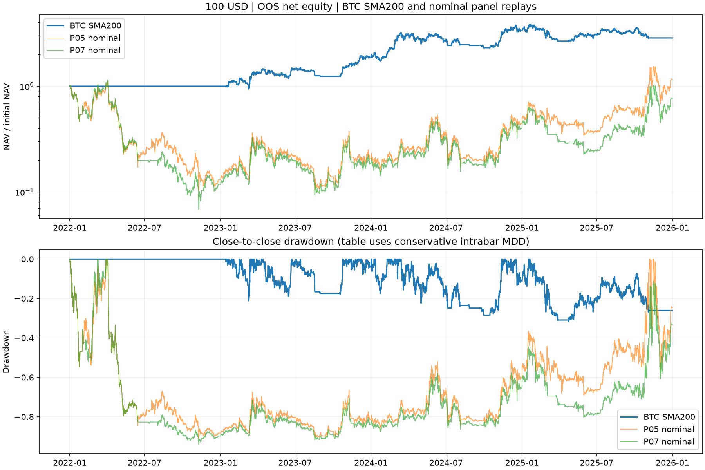
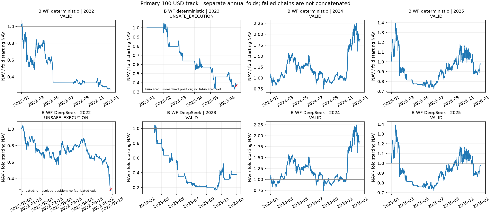

# TrendAtlas — zmrazený capacity follow-up

Zdrojový commit `f5ecbfd1a35dec62a4482cd1a1aa5181e6790551`. Nový experiment, pôvodné výsledky nemení. Primárny kapitál **100 USD**. Rozhodnutie: **REJECT**. Žiadny merge, deploy, Pi zásah ani živý obchod.

**B je REJECT aj v prípadoch, ktoré kapacita dovolí dokončiť.** Pri primárnych100 USD prejde nominálny replay iba P05 a P07; P07 zlyhá pri2× nákladoch. P05 má3,93% CAGR,92,33% MDD a po odstránení troch najlepších obchodov −40,75% CAGR. Ani jediný úplný nominálny variant z pevného panelu pri10 000 USD neprekonal benchmark gate; najvyšší CAGR je5,26% a najnižší MDD stále80,67%. Tieto väčšie účty sú diagnostika kapacity, nemenia primárny100 USD track.

**Zlyhania vykonania majú konkrétne príčiny.** Deterministický WF pri100 USD zostal19.6.2023 s RNDR zostatkom9,35 USD pod zmrazeným10 USD minimom; pri1 000 USD obdobne PEOPLE9,69 USD v auguste2024. Pri10k/100k USD sa uzatvorí, ale dosahuje približne −36% CAGR a96% MDD. DeepSeek WF držal pôvodnú LUNA pri májovom zastavení2022, kde ďalší realistický fill chýba, a preto nemá úplný bezpečný4-ročný výsledok pri žiadnom testovanom kapitáli. Nejde o tvrdenie, že živý Hyperliquid účet má tieto spot minimum-notional pravidlá.

**Komponentové výsledky sú podmienené dokončiteľnými párovými replaymi.** Pri10k USD volatility-adjusted ranking zlepšil CAGR vo všetkých7 dostupných pároch o4,30–20,93 percentuálneho bodu;6/7 párov znížilo MDD. Stále nevytvoril kvalifikovanú stratégiu. Monthly cadence znížila ročné náklady vo všetkých6 porovnateľných pároch o3,60–4,40 bodu, ale výnos a drawdown sa zlepšovali len v časti párov. Top3 oproti top1 znížilo MDD vo všetkých4 dokončiteľných pároch, výnos zlepšilo v2/4. Absolute filter v2 priamo porovnateľných pároch zhoršil CAGR aj MDD; neúplné ďalšie páry neumožňujú zovšeobecniť tento smer. Neuzatvoriteľné varianty zostávajú explicitne zlyhané, nie vynechané zo zoznamu.

**Najlepší zmrazený robustný slot podľa development drawdownu** je deterministický `B_2c32e4a6ac0b`:30d momentum/vol60, absolute+relative, top3 inverse-vol, monthly. Má však development MDD41,85%, takže zostáva REJECT. **Agresívny slot** oboch vetiev je `B_41999f301120`:90d momentum/vol60, absolute+relative, jeden víťaz, weekly; development CAGR93,77%, MDD65,55%, REJECT. Nejde o nasaditeľnú current_strategy_v2 ani o víťazov vybraných z OOS.

Kauzálny audit overil65 719 fillov,43 633 objednávok, identické signály všetkých120 povolených konfigurácií na dvoch skrátených históriách a skutočne nulové koncové pozície všetkých úspešných replayov.18 samostatne zopakovaných reálnych replayov súhlasí. Dollar PnL, náklady a koncentrácia turnoveru podľa aktíva aj epizódy sú v `results/concentration.json`. Prvý technicky neúspešný pokus je zachovaný v `attempts/`; žiadny parameter nebol upravený podľa výsledkov.

## Spoločná tabuľka

| $100 / stratégia | CAGR | MDD | Sharpe | Calmar | turn/rok | náklady/rok | obchody | hold d | +foldy | najhorší | 2× nákl. | +bar | bez best day | bez top3 | stav |
| --- | --- | --- | --- | --- | --- | --- | --- | --- | --- | --- | --- | --- | --- | --- | --- |
| BTC SMA200 | 30.00% | 33.00% | 0.91 | 0.91 | 8.99 | 1.80% | 18 | 4.50 | 2/4 | -14.67% | 27.68% | 27.87% | 26.85% | 0.22% | BENCHMARK / VALID |
| B WF deterministic | — | — | — | — | — | — | — | — | —/4 | — | — | — | — | — | REJECT / UNSAFE_EXECUTION |
| B WF DeepSeek | — | — | — | — | — | — | — | — | —/4 | — | — | — | — | — | REJECT / UNSAFE_EXECUTION |
| P01 | — | — | — | — | — | — | — | — | —/4 | — | — | — | — | — | REJECT / UNSAFE_EXECUTION |
| P02 | — | — | — | — | — | — | — | — | —/4 | — | — | — | — | — | REJECT / UNSAFE_EXECUTION |
| P03 | — | — | — | — | — | — | — | — | —/4 | — | — | — | — | — | REJECT / UNSAFE_EXECUTION |
| P04 | — | — | — | — | — | — | — | — | —/4 | — | -43.76% | — | — | — | REJECT / UNSAFE_EXECUTION |
| P05 | 3.93% | 92.33% | 0.62 | 0.04 | 37.46 | 7.49% | 75 | 7.00 | 3/4 | -86.93% | -3.40% | -43.77% | -4.34% | -40.75% | REJECT / VALID |
| P06 | — | — | — | — | — | — | — | — | —/4 | — | — | — | — | — | REJECT / UNSAFE_EXECUTION |
| P07 | -6.33% | 94.52% | 0.51 | -0.07 | 38.46 | 7.69% | 77 | 7.00 | 3/4 | -88.18% | — | -43.76% | -13.78% | -43.75% | REJECT / UNSAFE_EXECUTION |
| P08 | — | — | — | — | — | — | — | — | —/4 | — | -43.76% | — | — | — | REJECT / UNSAFE_EXECUTION |
| P09 | — | — | — | — | — | — | — | — | —/4 | — | — | — | — | — | REJECT / UNSAFE_EXECUTION |
| P10 | — | — | — | — | — | — | — | — | —/4 | — | — | — | — | — | REJECT / UNSAFE_EXECUTION |
| P11 | — | — | — | — | — | — | — | — | —/4 | — | — | — | — | — | REJECT / UNSAFE_EXECUTION |
| P12 | — | — | — | — | — | — | — | — | —/4 | — | — | — | — | — | REJECT / UNSAFE_EXECUTION |
| P13 | — | — | — | — | — | — | — | — | —/4 | — | — | — | — | — | REJECT / UNSAFE_EXECUTION |
| P14 | — | — | — | — | — | — | — | — | —/4 | — | — | — | — | — | REJECT / UNSAFE_EXECUTION |
| P15 | — | — | — | — | — | — | — | — | —/4 | — | — | — | — | — | REJECT / UNSAFE_EXECUTION |
| P16 | — | — | — | — | — | — | — | — | —/4 | — | — | — | — | — | REJECT / UNSAFE_EXECUTION |
| P17 | — | — | — | — | — | — | — | — | —/4 | — | — | — | — | — | REJECT / UNSAFE_EXECUTION |
| P18 | — | — | — | — | — | — | — | — | —/4 | — | — | — | — | — | REJECT / UNSAFE_EXECUTION |
| P19 | — | — | — | — | — | — | — | — | —/4 | — | — | — | — | — | REJECT / UNSAFE_EXECUTION |
| P20 | — | — | — | — | — | — | — | — | —/4 | — | — | — | — | — | REJECT / UNSAFE_EXECUTION |
| P21 | — | — | — | — | — | — | — | — | —/4 | — | — | — | — | — | REJECT / UNSAFE_EXECUTION |
| P22 | — | — | — | — | — | — | — | — | —/4 | — | — | — | — | — | REJECT / UNSAFE_EXECUTION |
| P23 | — | — | — | — | — | — | — | — | —/4 | — | — | — | — | — | REJECT / UNSAFE_EXECUTION |
| P24 | — | — | — | — | — | — | — | — | —/4 | — | — | — | — | — | REJECT / UNSAFE_EXECUTION |

Náklady sú súčet poplatkov a sklzu ako anualizovaný súčet podielov z aktuálneho NAV. Spot funding = 0. Turnover je ročný jednosmerný zobchodovaný notional/NAV, obchody sú úplné asset epizódy od nuly do nuly. MDD je konzervatívny OHLC portfóliový drawdown; Sharpe z denných výnosov. Bez top3 odoberá tri najväčšie úplné epizódy podľa reconciliovanej log atribúcie; nejde o nový simulovaný rebalancing. „—“ znamená chýbajúci úplný bezpečne uzatvorený replay, nikdy nulový výnos.

Všetkých 135 kombinácií stratégie/kapitálu obsahuje `results/common_table.csv`; každý spustený ročný fold a jeho dôvod zlyhania je v `results/annual_folds.csv`. Po zlyhaní compounding reťazca pokračujú ďalšie roky ako samostatné diagnostiky s pôvodným kapitálom a nevstupujú do spoločného CAGR.

## Rodiny

- A: pôvodný REJECT archivovaný; žiadny nový výpočet ani mutácia.
- B: nová kapacitná realizácia, 24 vopred určených variantov a dva rovnako rozpočtované walk-forward evolučné postupy.
- C: ARCHIVED_REJECT podľa predchádzajúceho experimentu; žiadna ďalšia optimalizácia.
- D: NOT_RUN. Verejné venue trade/mark/funding dáta stiahnuté a skontrolované, ale historický risk kontrakt nie je kompletný.
- E: NOT_RUN. Nie sú dve nezávisle kvalifikované rodiny B/D; dva varianty B sa nepreznačujú na dve rodiny.

## Presné spoločné pravidlá a PIT identita

Archívny census zahŕňa 568 historických USDT symbolov; 576 identít po rozdelení ticker reuse. Do intraday rámca vstúpilo 77 identít. Denný rolling30 priemer quote volume ≥10 mil. USD, aspoň365 pozorovaných denných barov danej identity, top10 likvidita. Žiadny dnešný survivor zoznam. Nové identity po redenominácii začínajú vlastný warmup; ceny ani výnosy sa nespájajú.

Signalizácia po uzavretom UTC dni, explicitná publikačná latencia60s. Najskorší 4h open je nasledujúci deň04:00 (lag2), stress08:00 (lag3). Weekly = nedeľný close; monthly = kalendárny month-end. Strata PIT eligibility alebo povinného kladného momentum generuje výstup, náhrada až pri plánovanom rozhodnutí. Volatilita je60d annualizovaná, floor0,1. Chýbajúci člen topK necháva svoj podiel v CASH. BTC benchmark: close>SMA200 long, inak CASH, identický execution kontrakt.

Objednávka má fixné množstvo, 0,1% posledného publikovaného 4h quote-volume na symbol/bar, realizovaný vlastný open ±10bp, fee10bp za fill. Vstup TTL6 barov, exit18; sell pred buy, spoločný cash budget. Čiastočný fill eviduje množstvo, cenu a zvyšok. Entry residual sa zruší, exit residual nikdy fiktívne neuzavrie. Ročný výstup je vopred plánovaný18 barov pred koncom, stress o bar neskôr.

Minimálny notional10 USD a zostatok >0,01 USD pri uzatvorení sú vopred zmrazené konzervatívne predpoklady; pri100 USD môžu dust zostatky blokovať bezpečne uzatvorený výkon. Lot/tick presnosť a kompletné historické admin oznámenia nie sú certifikované. Toto je model kapacity Binance spot, nie potvrdená kapacita živého Hyperliquid účtu.

## Vopred zmrazené komponentové porovnania

| ID | Konfigurácia | CAGR100 | MDD100 | Cost100 |
| --- | --- | --- | --- | --- |
| P01 | 90d momentum; surové poradie; relative-only; top 1; 100% do víťaza; weekly. | — | — | — |
| P02 | 90d momentum; surové poradie; relative-only; top 1; 100% do víťaza; monthly. | — | — | — |
| P03 | 90d momentum; surové poradie; absolute+relative (momentum>0); top 1; 100% do víťaza; weekly. | — | — | — |
| P04 | 90d momentum; surové poradie; absolute+relative (momentum>0); top 1; 100% do víťaza; monthly. | — | — | — |
| P05 | 90d momentum; delené vol60; relative-only; top 1; 100% do víťaza; weekly. | 3.93% | 92.33% | 7.49% |
| P06 | 90d momentum; delené vol60; relative-only; top 1; 100% do víťaza; monthly. | — | — | — |
| P07 | 90d momentum; delené vol60; absolute+relative (momentum>0); top 1; 100% do víťaza; weekly. | -6.33% | 94.52% | 7.69% |
| P08 | 90d momentum; delené vol60; absolute+relative (momentum>0); top 1; 100% do víťaza; monthly. | — | — | — |
| P09 | 90d momentum; surové poradie; relative-only; top 2; inverse-vol60; weekly. | — | — | — |
| P10 | 90d momentum; surové poradie; relative-only; top 2; inverse-vol60; monthly. | — | — | — |
| P11 | 90d momentum; surové poradie; absolute+relative (momentum>0); top 2; inverse-vol60; weekly. | — | — | — |
| P12 | 90d momentum; surové poradie; absolute+relative (momentum>0); top 2; inverse-vol60; monthly. | — | — | — |
| P13 | 90d momentum; delené vol60; relative-only; top 2; inverse-vol60; weekly. | — | — | — |
| P14 | 90d momentum; delené vol60; relative-only; top 2; inverse-vol60; monthly. | — | — | — |
| P15 | 90d momentum; delené vol60; absolute+relative (momentum>0); top 2; inverse-vol60; weekly. | — | — | — |
| P16 | 90d momentum; delené vol60; absolute+relative (momentum>0); top 2; inverse-vol60; monthly. | — | — | — |
| P17 | 90d momentum; surové poradie; relative-only; top 3; inverse-vol60; weekly. | — | — | — |
| P18 | 90d momentum; surové poradie; relative-only; top 3; inverse-vol60; monthly. | — | — | — |
| P19 | 90d momentum; surové poradie; absolute+relative (momentum>0); top 3; inverse-vol60; weekly. | — | — | — |
| P20 | 90d momentum; surové poradie; absolute+relative (momentum>0); top 3; inverse-vol60; monthly. | — | — | — |
| P21 | 90d momentum; delené vol60; relative-only; top 3; inverse-vol60; weekly. | — | — | — |
| P22 | 90d momentum; delené vol60; relative-only; top 3; inverse-vol60; monthly. | — | — | — |
| P23 | 90d momentum; delené vol60; absolute+relative (momentum>0); top 3; inverse-vol60; weekly. | — | — | — |
| P24 | 90d momentum; delené vol60; absolute+relative (momentum>0); top 3; inverse-vol60; monthly. | — | — | — |

Každý pár s odlišným jediným parametrom je ablation v pevnom90d paneli. Nevyberá sa nový víťaz podľa OOS panelu. Kvantitatívne párové rozdiely sú v `results/ablations.json`.

## Finalisti a Pareto

### deepseek

- aggressive: `B_41999f301120` — 90d momentum; delené vol60; absolute+relative (momentum>0); top 1; 100% do víťaza; weekly. Development2025 CAGR 93.77%, MDD 65.55%, Sharpe 1.16; benchmark REJECT, execution VALID.
- compromise: žiadny spôsobilý kandidát.
- robust: `B_004c52228678` — 30d momentum; delené vol60; absolute+relative (momentum>0); top 2; inverse-vol60; weekly. Development2025 CAGR 5.21%, MDD 44.09%, Sharpe 0.38; benchmark REJECT, execution VALID.

### deterministic

- aggressive: `B_41999f301120` — 90d momentum; delené vol60; absolute+relative (momentum>0); top 1; 100% do víťaza; weekly. Development2025 CAGR 93.77%, MDD 65.55%, Sharpe 1.16; benchmark REJECT, execution VALID.
- compromise: žiadny spôsobilý kandidát.
- robust: `B_2c32e4a6ac0b` — 30d momentum; delené vol60; absolute+relative (momentum>0); top 3; inverse-vol60; monthly. Development2025 CAGR 17.79%, MDD 41.85%, Sharpe 0.60; benchmark REJECT, execution VALID.

Robustný/agresívny sú označenia predom určených development výberov, nie certifikovaní víťazi. Ich pravidlá na forward sú zmrazené pred outer replay. Žiadne nové forward/sealed dáta neboli otvorené. Roky2022–2025 sú historické chronologické outer foldy; rok2021 development prvého originu. Predchádzajúci rok neskoršieho originu slúži ako jeho development; API nedostáva outer výsledky ani kompletnú OOS tabuľku.

## Kapacita a náklady

| Postup | max bezpečný testovaný USD | max ≥95% fill aj stres USD |
| --- | --- | --- |
| BTC SMA200 | 1000000 | 100000 |
| B WF DeepSeek | None | None |
| B WF deterministic | 100000 | 100000 |

| Postup | kapitál | CAGR | MDD | fill% | partials | feeUSD | slipUSD | fundUSD | status |
| --- | --- | --- | --- | --- | --- | --- | --- | --- | --- |
| BTC SMA200 | 100 | 30.00% | 33.00% | 100.00% | 0 | 8.93 | 8.93 | 0.00 | VALID |
| BTC SMA200 | 1000 | 30.00% | 33.00% | 100.00% | 0 | 89.26 | 89.26 | 0.00 | VALID |
| BTC SMA200 | 10000 | 30.00% | 33.00% | 100.00% | 0 | 892.59 | 892.61 | 0.00 | VALID |
| BTC SMA200 | 100000 | 29.86% | 33.08% | 99.96% | 28 | 8931.53 | 8931.73 | 0.00 | VALID |
| BTC SMA200 | 1000000 | 28.14% | 23.75% | 70.91% | 206 | 56760.59 | 56762.40 | 0.00 | VALID |
| B WF deterministic | 100 | — | — | — | — | — | — | — | UNSAFE_EXECUTION |
| B WF deterministic | 1000 | — | — | — | — | — | — | — | UNSAFE_EXECUTION |
| B WF deterministic | 10000 | -36.08% | 96.37% | 99.94% | 25 | 136.43 | 136.43 | 0.00 | VALID |
| B WF deterministic | 100000 | -35.56% | 96.22% | 99.56% | 99 | 1384.17 | 1384.09 | 0.00 | VALID |
| B WF deterministic | 1000000 | — | — | — | — | — | — | — | UNSAFE_EXECUTION |
| B WF DeepSeek | 100 | — | — | — | — | — | — | — | UNSAFE_EXECUTION |
| B WF DeepSeek | 1000 | — | — | — | — | — | — | — | UNSAFE_EXECUTION |
| B WF DeepSeek | 10000 | — | — | — | — | — | — | — | UNSAFE_EXECUTION |
| B WF DeepSeek | 100000 | — | — | — | — | — | — | — | UNSAFE_EXECUTION |
| B WF DeepSeek | 1000000 | — | — | — | — | — | — | — | UNSAFE_EXECUTION |

Maximum znamená najvyšší bod z mriežky100/1k/10k/100k/1m, bez extrapolácie. Kapacita sa posudzuje nezávisle od dosiahnutia alpha cieľa. Panel má cost/delay stres iba pre100 USD; jeho väčšie kapitály nie sú vydávané za plne stresovo certifikované.

## Ročné OOS foldy

| Postup | rok | CAGR | MDD | Sharpe | cost/rok | status |
| --- | --- | --- | --- | --- | --- | --- |
| BTC SMA200 | 2022 | 0.00% | 0.00% | 0.00 | 0.00% | VALID |
| BTC SMA200 | 2023 | 86.19% | 22.58% | 1.72 | 1.20% | VALID |
| BTC SMA200 | 2024 | 79.62% | 29.67% | 1.47 | 2.39% | VALID |
| BTC SMA200 | 2025 | -14.67% | 33.00% | -0.31 | 3.60% | VALID |
| B WF deterministic | 2022 | -74.61% | 76.00% | -1.38 | 1.95% | VALID |
| B WF deterministic | 2023 | — | — | — | — | UNSAFE_EXECUTION |
| B WF deterministic | 2024 | 87.37% | 55.18% | 1.24 | 2.65% | VALID |
| B WF deterministic | 2025 | -2.20% | 50.39% | 0.20 | 4.47% | VALID |
| B WF DeepSeek | 2022 | — | — | — | — | UNSAFE_EXECUTION |
| B WF DeepSeek | 2023 | -62.41% | 85.96% | -0.62 | 4.00% | VALID |
| B WF DeepSeek | 2024 | 87.37% | 55.18% | 1.24 | 2.65% | VALID |
| B WF DeepSeek | 2025 | -2.20% | 50.39% | 0.20 | 4.47% | VALID |

## Susedné parametre a koncentrácia

| arm | origin | parent | pozitívne/DD≤35 | medián CAGR | PASS |
| --- | --- | --- | --- | --- | --- |
| deepseek | 2022 | B_8b05daa93d29 | 0/7 | 125.69% | False |
| deepseek | 2023 | B_a449bd971465 | 0/6 | -80.25% | False |
| deepseek | 2024 | B_4f766480827f | 0/7 | 87.68% | False |
| deepseek | 2025 | B_2a32821abc4c | 0/7 | 74.25% | False |
| deepseek | 2026 | B_004c52228678 | 0/7 | -9.27% | False |
| deepseek | 2026 | B_41999f301120 | 0/7 | 40.46% | False |
| deterministic | 2022 | B_b2f20e47cac8 | 0/8 | 115.15% | False |
| deterministic | 2023 | B_a449bd971465 | 0/6 | -80.25% | False |
| deterministic | 2024 | B_4f766480827f | 0/7 | 87.68% | False |
| deterministic | 2025 | B_2a32821abc4c | 0/7 | 74.25% | False |
| deterministic | 2026 | B_2c32e4a6ac0b | 0/6 | -4.98% | False |
| deterministic | 2026 | B_41999f301120 | 0/7 | 40.46% | False |

Čisté log príspevky aj podiel z hrubých kladných príspevkov podľa aktíva/obchodu sú v spoločnej tabuľke JSON. Kompletná dollar PnL a fee/slippage atribúcia je v ledgeroch; čistý podiel pri celkovej strate je nedefinovaný, nie vynulovaný.

## DeepSeek — skutočné volania

API volania: **15**; odpovede s usage: **15**; tokeny: **32577**; tarifný odhad ceny **$0.003788**, rezervovaný konzervatívny horný rozpočet **$0.063282**. Prijaté návrhy: 60, odmietnuté: 0. Model `deepseek-flash`, thinking disabled, maximálne15 volaní/2000 output tokenov a1 USD. Cena je odhad podľa času a usage, nie faktúra.

Každá vetva má110 development kandidátov (5originov×22), populáciu10,6preživších a4mutácie,4generácie. Neúspešné alebo duplicitné návrhy nahradí deterministická mutácia; žiadny dodatočný evaluation budget. Raw JSON odpovede, whitelist payload, prijaté/odmietnuté návrhy a dôvody sú v `results/designer_events.jsonl`. Kľúč ani autorizácia sa neukladajú. [Oficiálny cenník](https://api-docs.deepseek.com/quick_start/pricing).

| origin | det dev CAGR | AI dev CAGR | det OOS CAGR | AI OOS CAGR |
| --- | --- | --- | --- | --- |
| 2022 | 137.65% | 396.48% | -74.61% | — |
| 2023 | -76.36% | -76.36% | — | -62.41% |
| 2024 | 261.46% | 261.46% | 87.37% | 87.37% |
| 2025 | 54.82% | 54.82% | -2.20% | -2.20% |
| 2026 | 17.79% | 5.21% | — | — |

Akceptovaný návrh znamená schema-valid nový kandidát, nie úspešnú alpha. Rozdiel dvoch vetiev v jednom pevnom seede nie je dôkaz všeobecnej prevahy AI.

## Rodina D: presná dátová medzera

Pre BTCUSDT,ETHUSDT,BNBUSDT,XRPUSDT,SOLUSDT chýba úplná verzovaná história maintenance margin brackets, liquidation/insurance pravidiel a sadzieb, certifikovaných listing/delisting dátumov a historických account fee tier/symbol filtrov pre **2021-01-01 00:00 až2026-01-01 00:00 UTC**. Každý chýbajúci4h price alebo8h funding interval je osobitne vypísaný v `perpetual_data_gate.json`. Verejné cenové archívy tieto risk podklady nenahrádzajú. Dátový gate sa reálne spustil; štyri stratégie sa nevydávajú za odsimulované.

| variant | stav | pravidlá |
| --- | --- | --- |
| long_short_cross_sectional_momentum | NOT_RUN | Monthly 90d momentum divided by 60d volatility; top2 long, bottom2 short, inverse-vol weights, gross1 net0; distinct long/short cashflows, timestamp funding required. |
| BTC_long_cash_short_SMA200 | NOT_RUN | BTC daily close above SMA200 for 7 consecutive days: +1; below for 7: -1; otherwise retain last confirmed regime, start CASH. Daily decision, delayed venue fill. |
| beta_neutral_top_bottom | NOT_RUN | Monthly 90d momentum top2/bottom2; 180d venue daily BTC betas and vol60; solve nonnegative leg weights for zero estimated BTC beta, gross<=1; infeasible solution CASH. |
| funding_aware | NOT_RUN | Same long/short cross-sectional base; only published trailing7d actual funding may remove a leg whose adverse annualized funding exceeds positive annualized90d signed momentum. No future funding sign available to selector. |

[Binance bracket API](https://developers.binance.com/docs/derivatives/usds-margined-futures/account/rest-api/Notional-and-Leverage-Brackets) je autentifikovaný aktuálny endpoint, nie verzovaný historický zdroj. Nebol zavolaný a exchange/account kľúče sa nečítali. [Historická zmena margin tierov](https://www.binance.com/en/support/announcement/detail/86cf9aa472574b8cb2e05bb751c2a9a6) dokladá, prečo aktuálna tabuľka nestačí.

## Reprodukcia a audit

Výpočet: 220 development, 82 neighbor a 852 ročných outer replayov; 874.5s runtime. Príkazy v README, FILES READ/SOURCE OF TRUTH/root cause/contract impact/git add v AUDIT.md. CenaAPI sa pri offline reprodukcii neúčtuje; použijú sa uložené validované návrhy.

