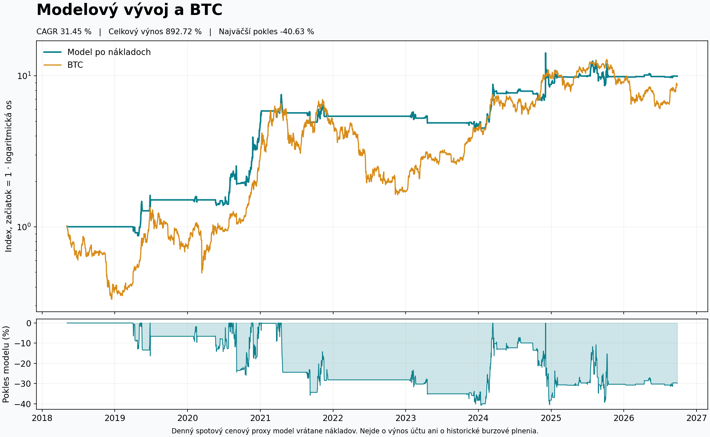

# Kauzálna rekonštrukcia modelového baseline

Stav: **kandidát na kontrolu, bez nasadenia**. Základ vetvy je `6fccbc388c1db75f6b46113fac15b7d3232e4123`. Predchádzajúci audit je `604125383a7cb16948ec7a2ca0f1c9280fca427a`.

Publikovaný časový rad do 2026-09-25 je z obnovených vstupov numericky reprodukovateľný. Opravený kandidát má CAGR **31,4471 %**, celkový výnos **892,7171 %**, maximálny drawdown **−40,6292 %**, Sharpe **0,7511**, Sortino **1,5890** a Calmar **0,7740**. Ide o model s explicitnou dennou spotovou cenovou náhradou a nákladovými predpokladmi; úplné historické Hyperliquid plnenia, mark ceny, funding a historické verzie makro dát nie sú k dispozícii.

## Reprodukcia bez Pi a bez siete

Python 3.12, závislosti z `requirements.txt`. Z koreňa tohto checkoutu:

```powershell
python -m pip install -r research/causal_baseline_20260926/requirements.txt
python research/causal_baseline_20260926/run.py
python research/causal_baseline_20260926/run.py --out research/causal_baseline_20260926/scratch/determinism
python -m unittest discover -s research/causal_baseline_20260926 -p test_causal.py -v
python research/causal_baseline_20260926/render_chart.py
```

Inštalácia závislostí potrebuje sieť alebo lokálny wheel cache; samotná reprodukcia je offline. Skripty rozbalia hashovo overené vstupy do `scratch/`, importujú výpočtové funkcie zachyteného kódu a vytvoria výsledky v tomto research adresári. Nespúšťajú produkčné entrypointy ani celé výskumné mriežky. Dva úplné prepočty trvajú rádovo minúty. `scratch/` sa necommituje.

## Výstupy

- [AUDIT.md](AUDIT.md): príčina, kontrakt, proveniencia, všetky tri konkrétne dni a vykonané kontroly.
- [DECISION.md](DECISION.md): samostatné rozhodnutie o ďalšom risk-overlay výskume po úspešných testoch.
- [input_bundle.manifest.json](input_bundle.manifest.json): 806 súborov, originálne/stored SHA256, relatívne cesty, pôvodné časy a redakcie.
- [EVIDENCE_AUDIT.json](EVIDENCE_AUDIT.json): runtime commit, zhoda 50 zdrojových súborov, beh, kroky, rozsahy dát a proveniencia dostupnosti signálov.
- [results/comparison.json](results/comparison.json): metriky oboch modelov, náklady, posledný cieľ a tri dni.
- [results/causal_ledger.csv](results/causal_ledger.csv): kompletných 3 066 intervalov, signály, vykonané expozície, ceny, náklady a riadky zdrojov.
- [results/active_periods.csv](results/active_periods.csv): súvislé obdobia medzi zmenami pozície, s odkazmi na riadky ledgeru.
- [results/price_provenance.csv](results/price_provenance.csv): ceny každej mince s konkrétnym zdrojovým súborom, stĺpcom a riadkom.
- [results/signals.csv](results/signals.csv) a [results/signal_lineage.csv](results/signal_lineage.csv): rozhodnutia a zachovaná diagnostika ich vzniku.
- [results/daily_comparison.csv](results/daily_comparison.csv): všetky dni a podpísaný rozklad zmeny výnosu.
- [results/removed_returns.csv](results/removed_returns.csv): 646 dní so zníženým čistým denným výnosom; obsahuje percentuálne body a rozklad, nie iba zoznam priaznivých prípadov.
- [results/asset_mapping_audit.csv](results/asset_mapping_audit.csv): 502 nesúladov aktívnych pôvodných názvov s ekonomickou líniou.
- [results/reproduction_manifest.json](results/reproduction_manifest.json): verzie, predpoklady a hashe výpočtového kódu a výsledkov.
- [results/dashboard_model_chart.csv](results/dashboard_model_chart.csv): opravený kontrakt grafu. PNG a SVG sú vytvorené výhradne z tohto CSV.



## Čo presne znamená kandidát

Pravidlá a parametre stratégie sa neoptimalizovali. Týždenný výber, trend, persistence a cooldown používajú zachytený kód a pôvodné parametre. Ekonomická identita vetvy BASE sa rozkladá podľa podkladovej stratégie, výnos sa počíta z konkrétnych cien a rozhodnutie z dňa D sa vykoná až na cenovom bode po dostupnosti signálu. Jednotky pozície zostávajú medzi zmenami cieľa pevné; expozícia preto môže driftovať. Náklady sa nevkladajú skryto do gross return.

Pre 3 041 historických rozhodnutí nie je zachovaný presný denný build log. Použitý je výslovne predpokladaný čas D+1 12:00 UTC; 24 dní využíva zachovaný čas validácie pôvodného buildu a posledný deň čas publikovaného snapshotu. Všetky sú kontrafaktuálnym harmonogramom opraveného modelu. Kompletná denná spotová séria umožňuje vstup najskôr na nasledujúcom dennom open. Ide o oneskorený proxy model, ktorý nemá zaručené pesimistické skreslenie ceny ani výnosu.

Posledný týždenný kandidát je stále AVAX, ale ekonomický modelový cieľ po oprave je **LTC 1,25×**. Tento cieľ v ledgeri nezískava žiadny výnos: jeho dostupnosť je až po konci cenového datasetu. Produkčný kód, rotácia, účet, AVAX pozícia, timery a order execution sa touto vetvou nemenia.

`collect_inputs.py` je samostatný read-only SFTP zberač pre nový autorizovaný zber. Heslo vyžiada bez zápisu do súborov. `prepare_bundle.py` spája overené zbery a odstraňuje nepotrebné account/order payloady. Na reprodukciu uloženého baseline sa tieto sieťové kroky nevykonávajú.
