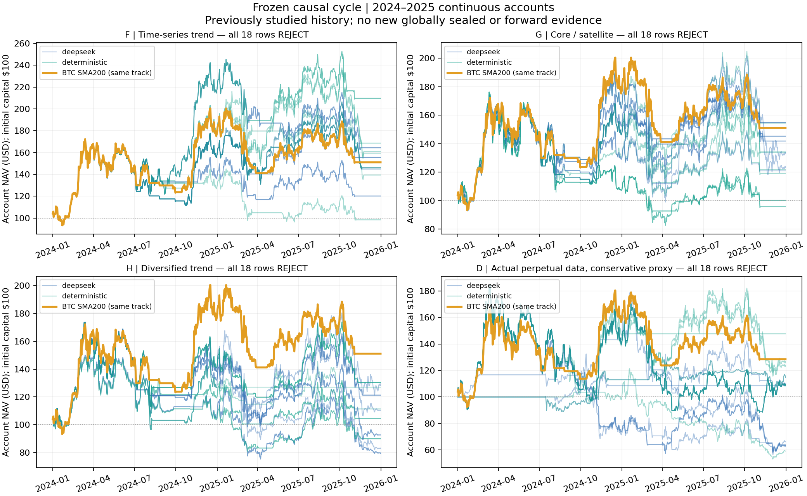

# TrendAtlas causal evolution — terminal research result

**SEALED / REJECT. All 72 frozen schedule results failed qualification.** The same experiment `causal_nested_v1_20260927` completed on VPS on **2026-09-28 at 20:02:42 UTC (22:02:42 CEST)** after the separately audited Pi recovery and migration. No new historical search was started for this delivery.

The drawdown goal remains ≤20%, acceptable ≤30%, with an absolute 35% limit; Sharpe ≥1.5 and Calmar ≥4. No candidate reaches the 150–200% CAGR objective. A (qualified high return), B (qualified MDD ≤25%) and C (valid Pareto compromise) are null; D is **REJECT**. E contains frozen nominees awaiting prospective observations, not an accepted ensemble. Historical data were previously studied: **SEALED is the terminal experiment state, not new globally independent evidence**. No prospective result or production promotion exists.

## Results against the recomputed benchmark

Primary results use one continuous USD 100 account during 2024–2025, carrying cash and positions across frozen annual rule changes. Representative family rows below have the highest historical Calmar within their family; this is a descriptive display after completion, not a new nomination. All 18 labeled rows per family, including duplicate slots, remain in the full table.

|Family / descriptive row|Arm / seed / slot|CAGR|MDD|Sharpe|Calmar|Net costs USD|Decision|
|---|---|---:|---:|---:|---:|---:|---|
|BTC SMA200 spot|fixed benchmark|22.91%|33.00%|0.707|0.694|7.946|REFERENCE|
|F time-series trend|deterministic / 4517 / A|44.78%|36.36%|1.061|1.232|5.877|REJECT|
|G core/satellite|DeepSeek / 4517 / A|24.47%|38.36%|0.728|0.638|5.451|REJECT|
|H diversified own-trend|deterministic / 4517 / A|14.19%|42.07%|0.528|0.337|5.501|REJECT|
|BTC SMA200 actual-perp proxy|fixed benchmark|13.36%|34.37%|0.507|0.389|29.867|REFERENCE / PROXY|
|D highest family Calmar|deterministic / 1701 / B|21.51%|46.82%|0.650|0.459|23.290|REJECT / PROXY|
|D highest Calmar with MDD ≤25%|both arms / 4517 / B|7.12%|22.77%|0.448|0.313|3.157|REJECT / PROXY|

The old approximate 30% BTC CAGR was not imported. Recomputed spot and funding-bearing perp benchmarks must be compared with their own venue track. Neither represents actual TrendAtlas wallet returns.

F CAGR ranges −0.79–44.78%, MDD 36.36–46.09%; G −2.13–24.47%, MDD 36.98–54.39%; H −10.87–14.19%, MDD 42.07–53.76%; D −23.04–21.51%, MDD 15.66–69.42%. Every spot row breaches the absolute 35% MDD limit. No row reaches Sharpe 1.5 or Calmar 4. The low-drawdown D row improves drawdown/concentration versus its benchmark but fails full qualification.

The [common table](../causal_delivery_20260928/derived/common_comparison.csv) contains all 72 results plus both benchmarks: CAGR, MDD, Sharpe, Calmar, turnover, dollar fees/slippage/funding, net costs, closed trades, median holding, profitable/worst fold, 2× costs, delayed fill, no best day, no top three whole episodes, exposure, concentration, residual and capacity. Turnover is annualized traded notional divided by contemporaneous NAV; trades count closed asset/side episodes and holding time is their median. Dollar costs are totals over the two-year account. Absent benchmark stress runs are explicitly `NOT_EVALUATED`; no post-seal backtest was invented.

## Folds, stresses and ablation

For the representative F schedule, 2024 annualized return is +115.90%, MDD 36.36%; 2025 −3.02%, MDD 28.59%. BTC spot is +76.53% / 29.67% in 2024 and −14.50% / 33.00% in 2025. BTC perp is +57.75% / 33.10% and −18.61% / 34.37%. The frozen 365.25-day annualization differs slightly from simple calendar returns.

|Same representative row|2× costs CAGR|Later bar CAGR|No best day CAGR|No top 3 episodes CAGR|No holding cap CAGR / MDD|
|---|---:|---:|---:|---:|---:|
|F|42.48%|44.19%|36.88%|−16.63%|44.99% / 33.58%|
|G|22.33%|23.68%|18.26%|−19.59%|24.20% / 36.15%|
|H|11.94%|13.65%|7.32%|−19.07%|15.10% / 39.73%|
|D family Calmar row|12.43%|21.79%|13.01%|−21.22%|25.10% / 43.86%|
|D MDD ≤25% row|5.35%|13.00%|3.32%|−12.47%|7.21% / 22.46%|

The fixed 90-day holding constraint is not supported as an improvement by these descriptive ablations. Removing it improves F drawdown but does not repair its target shortfall, concentration, robustness or statistical rejection. This does not authorize a new OOS-selected candidate. Best-day/whole-episode removal is attribution sensitivity, not an executable alternative account.

F's two frozen neighbors return 44.95% / 36.36% MDD and 21.61% / 45.05%; G 11.14% / 38.03% and 20.64% / 40.97%; H 4.41% / 42.07% and 19.17% / 40.34%; D 19.95% / 46.92% and 38.37% / 49.44%. These do not establish an acceptable plateau. D's low-drawdown row returns −2.75% under adverse mark/fill/funding assumptions. No stop, trailing, TP or new leverage layer was added to rescue rejected bases; no ensemble was formed. B/C stayed archived.

Full [continuous yearly folds](../causal_delivery_20260928/derived/continuous_annual_folds.csv), [stresses/neighbors](../causal_delivery_20260928/derived/continuous_stresses_neighbors.csv), [capacity](../causal_delivery_20260928/derived/continuous_capacity.csv), and [whole episodes](../causal_delivery_20260928/derived/episodes.csv) accompany the original [all-fold export](../causal_delivery_20260928/raw/annual_folds_stresses_capacity.csv). The latter also contains independently initialized annual diagnostics: only `book=CONTINUOUS_PRIMARY` represents the main account. Regime attribution is from separate annual diagnostic books.

## Exact rules and accounting

Every complete annual rule is in [exact_rules.csv](../causal_delivery_20260928/derived/exact_rules.csv), [frozen_finalists.json](../causal_delivery_20260928/raw/frozen_finalists.json) and SQLite. Descriptive rows use:

|Row|2024 frozen rule|2025 frozen rule|
|---|---|---|
|F|BTC momentum 365, weekly, confirmation 3|BTC SMA200, monthly, confirmation 0|
|G|Own momentum 180, weekly, BTC core 75%, two satellites sharing 25%|SMA200, monthly, BTC core 75%, one satellite 25%|
|H|Dual SMA50/200, weekly, top 2 PIT liquidity, inverse-vol|SMA200, weekly, top 2 PIT liquidity, equal-risk|
|D family Calmar row|BTC long/CASH/short momentum 180, monthly, target gross 1.25|Beta-neutral breakout120, weekly, top_k=1, target gross 1.0|

These are frozen annual adaptive schedules, not retrospectively fitted static rules. D's top_k=1 beta-neutral rule cannot form two legs from one asset and targets CASH; inherited positions still require real exits. Shown hysteresis is zero; all tested hysteresis is symmetric. Entries/reweights are weekly/monthly, while confirmed invalidation may request a daily exit. G removes satellite targets on BTC regime loss. Missing/nonpositive-trend members stay CASH. H computes risk weights on the liquid cohort before zeroing nonpositive members.

The single PIT admission routine requires 365 observed days, 30-day average quote liquidity ≥USD 10m, historical identity segments and timestamped notices. It selects up to five by historical liquidity; unavailable prices never become tradable zero returns. Perp signals use their own prices with the declared common spot-liquidity census. No BASE stream, cross-asset transferred PnL, same-day filtering of earned returns, or production paper equity is used.

Fills use completed daily signals, publication delay plus 60 seconds and the first actual 4h open after availability; delay stress uses the next realizable bar. Participation is 0.1% of lagged quote volume, entry TTL 6 / exit TTL 18. Cancellation removes unfilled orders, not owned residuals; these stay marked. Fees/slippage are 10 bps each. Double-cost stress doubles fees, slippage and funding debits, not credits. No fictitious exit is used.

These are **Binance spot / actual USD-M conservative proxies, never certified Hyperliquid history**. Historical margin brackets and fee/lot rules remain incomplete. D includes maintenance 10%/ 20%, adverse mark and funding scenarios. Target gross 1.0/ 1.25 is not a continuous hard cap: marked positions reach **1.70055 actual gross**. This material limitation is disclosed; the frozen evaluator was not changed.

Capacity was tested at USD 100/ 1k/ 10k/ 100k. At USD 100, 68/72 continuous books are execution-reliable; at each larger size, 72/72. All rows report 100k as the largest reliable tested point, not unlimited capacity or a guarantee for all smaller sizes. The four unreliable USD 100 rows are H (DeepSeek seed 1701 A/C and deterministic seed 2903 A/C), flagged holding_horizon_exit_unfilled; tiny unfilled positions cannot be silently closed. Reliability is nonmonotonic under this sizing/dust model. Maximum observed USD 100 residual is 28.03; the low-drawdown D row ends with 3.383 included in MTM. USD 1m was outside this frozen cycle's contract and is **NOT_RUN**. Binance rules are not asserted as Hyperliquid rules.

Net costs = fees + slippage + funding debits − credits. F pays 2.939 fees +2.939 slippage. D's Calmar row pays 2.015 fees +2.015 slippage +20.157 funding debits −0.898 credits = 23.290. D's low-drawdown row pays 1.761+1.761+3.849−4.214= 3.157. These are dollars on the simulated USD 100 continuous account, not annual percentages or wallet PnL.

## Statistical gates and Pareto front

|Failed gate|Rows / 72|
|---|---:|
|Inner folds; top-three-episode loss; seed stability; DSR; bootstrap/Holm; CSCV/PBO|72 each|
|Execution/cost/margin stress|71|
|Parameter plateau|70|
|MDD >35%|69|
|BTC SMA200 noninferiority/gain|63|
|Asset concentration|56|
|Statistical power INCONCLUSIVE|54|
|Episode concentration|41|
|Best-day removal nonpositive|28|
|Nominal execution reliability|4|

The [Pareto front](../causal_delivery_20260928/raw/pareto_front.json) has 29 labeled rows, all REJECT. Nondominance is relative, not acceptance. This report front pools proxy tracks and retains slot duplicates; venue-specific benchmark comparisons remain necessary. Search uses no weighted scalar fitness.

PBO is F 0.4143, G/H 0.3714, D 0.4857, above 0.1. All Holm-adjusted p-values are 1.0. Bootstrap uses 499 stationary-block replicates, mean block 30 days. DSR counts 2,271 within-cycle hypotheses/interruptions, not every earlier informal research choice. Small episode counts make 54 results INCONCLUSIVE, never PASS. Numerical targets fail even before these statistical gates.

## Actual DeepSeek usage and matched budgets

**96 API calls, 93 completed responses, 3 URLError fallbacks with uncertain usage.** Known responses report 483,589 tokens and a documented peak-rate cost estimate **USD 0.18380472**. Unknown calls reserve **USD 0.02017560**; known estimate plus reservations is **USD 0.20398032**, not an invoice. Uncertain calls counted toward the limit and were not retried.

177 proposals were accepted. 183 individual proposals were invalid: 155 inactive-gene changes, 19 duplicate IDs, 3 invalid cadence, 2 invalid H weighting, 2 invalid signals, 2 invalid confirmation. Three invalid four-candidate envelopes lost 12 slots; three network failures lost 12. All **207 missing/rejected slots** received deterministic replacements without budget expansion. [Full API records](../causal_delivery_20260928/raw/deepseek_proposals.json) preserve prompts, responses, validation and usage without credentials.

Each arm consumed 624 new slots: 240 seeds +384 mutations. The AI arm contains 177 accepted AI mutations +207 fallbacks; the control has 384 deterministic mutations. Five generations completed throughout, producing 240 populations and 2,400 score rows.

|Family|Deterministic median CAGR / MDD|DeepSeek-arm median CAGR / MDD|Passes|
|---|---:|---:|---:|
|F|26.24% / 37.19%|20.83% / 37.19%|0 / 0|
|G|9.15% / 45.67%|19.11% / 39.34%|0 / 0|
|H|5.53% / 45.47%|−3.73% / 51.74%|0 / 0|
|D|4.63% / 53.35%|4.18% / 53.35%|0 / 0|

These are descriptive medians over nine labeled rows per family/arm, with duplicate nominees and shared history, not an independent AI treatment effect. No OOS result feeds another mutation. All 96 saved prompts passed the frozen development/inner-validation schema and exact date checks; no outer/prospective input or generated code was executed.

## Terminal evidence and provenance

The final snapshot was taken under both research locks at **20:16:14 UTC**, after sealing. The existing 18:47 `export/latest` held only 5,112 results and was rejected as stale. The final VPS backup is `/var/backups/trendatlas-research/final-causal_nested_v1_20260927`. Reporting changed neither live experiment nor export symlink.

|Check|Verified result|
|---|---|
|Evaluations /attempts|7,203 / 7,211; 8 preserved INTERRUPTED, none running|
|Scopes|2,974 train; 2,974 validation; 1,255 outer|
|Configurations /trials|1,126 / 3,415|
|Annual nominees /continuous schedules|144 / 72|
|Active research time|33,431.827 seconds, below 24-hour ceiling|
|Stored own-asset fill audits|7,203 PASS|
|Actual prefix/future-mutation audits|144 PASS|
|Archive /databases|132 files verified; both SQLite integrity OK, foreign keys clean|
|Equity verification|74 books × 731 days = 54,094 rows matched SQLite|
|Last development /first outer|19:20:13 / 19:20:21 UTC September 28|

All recorded trials and API payloads precede first outer. The pinned controller freezes all nominees first. Mailbox `SEALED.json` at 19:48:08 is refreshed on outer resume, not the first freeze timestamp. Generated status retains contractual prospective floor 2026-09-27, but actual nominees froze September 28: **earliest fully closed prospective UTC day is September 29**, subject to collection. September 27–28 is not claimed as new forward evidence.

Frozen engine **53b6a5336ca1f7ce35b481a017f7e82396f3613c**, fingerprint **eeb244ea6a79ef396f8f607696eebe08115b4a3a3bb16d4e74d0d251df0d8385**. All 38 manifest hashes, including 7 raw inputs, match. [Recovery/migration audit](../causal_migration/REPORT.md) and all prior evidence remain unchanged.

[Original equity CSV](../causal_delivery_20260928/raw/equity.csv), [original SVG](../causal_delivery_20260928/raw/equity.svg), [overview SVG](../causal_delivery_20260928/equity_overview.svg), and [archive parts/index](../causal_delivery_20260928/archive/index.json) are committed. Whole archive SHA256: `d7ae706d1e082ff9b303fafb0d834c146575bf97bc1354ef727d9357b9d588cc`. Candidates SQLite: `0d90fb77ccb04632cad83b1f7ad6eef73f62295f0ba8f296d9813c876a5ed41c`; mailbox: `4f48023b7b6079345bbe328f4baf6a11e1229d0eb39fd6d0004599ad37514d70`.

## Delivery

[Reproduction commands](../causal_delivery_20260928/README.md) reconstruct and verify stored results without restarting historical evolution. [INITIAL_REPORT.md](../causal_delivery_20260928/INITIAL_REPORT.md) preserves the initial report bytes. See [AUDIT.md](AUDIT.md), [FILES_READ.md](FILES_READ.md), and [exact git add list](../causal_delivery_20260928/GIT_ADD.txt).

Pi remains at 5,087, research inactive; production timer read-only verified active/enabled at 20:27 UTC. VPS worker is inactive/success. Dispatcher failed/255 logs come from the installed admission routine refusing SEALED state; they are log noise, not a failed scientific cycle. The deployment was left unchanged. Production checkout, dashboard, account, orders, Pi timers and LeadPilot were not changed by this handoff.

Branch: `codex/causal-continuous-evolution-20260927`. Commit message: `research: archive sealed causal cycle and audit rejected finalists`. Commit hash is in the final handoff and resolves with `git log -1 --format=%H -- research/causal_delivery_20260928`. After successful push, the Codex completion monitor is stopped. No merge/deploy. Later cycles remain subject to the existing frozen refit contract: earliest 2027-01-01, new closed data, append-only coverage and a complete new annual outer window. Rejection does not authorize repeating evolution on the same history.
