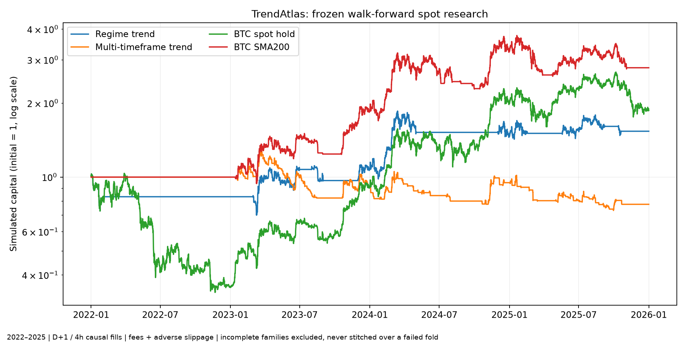

# TrendAtlas — nový strategický research framework

**Rozhodnutie: REJECT pre potvrdenú náhradu produkčnej stratégie.** Framework bol implementovaný, otestovaný a reálne spustený. Výsledky nižšie sú nové výpočty; staré CAGR ani paper equity nevstupujú do stratégie, výberu alebo účtovania.

Rozpočet: **330 kandidátskych hodnotení**, 3 oddelené rodiny × 5 vývojových počiatkov × 4 generácie; populácia 10, 6 preživších, 4 nové mutácie. Ďalej 86 susedných konfigurácií, 36 ablácií a 12 zmrazených ročných OOS testov. Pri vykonateľných kandidátoch sa replay zopakoval s 2× nákladmi a s fillom o jeden 4h bar neskôr; nevykonateľné kandidáty končia explicitným zamietnutím. Samostatne sa overili aj stresy referenčných baseline a susedia finálnych nominantov.

## Dátový model a rozsah

Spot na Binance, 20 párov vybraných iba podľa uzavretého decembra 2020 z celého archívneho zoznamu USDT symbolov. Do rozhodnutí vstupuje posledných 30 dokončených dní quote-volume, hranica 10 miliónov USD/deň, top10 v tomto pevnom kohorte a minimálne 365 pozorovaných dní. Kohorta nepridáva neskorších víťazov a nevyhadzuje neskôr zaniknuté aktíva. Ide o vopred daný kohortový universe, nie celý kryptotrh.

Surové 4h archívy majú overený SHA256 poskytovateľa. Samostatná evidencia prvého obchodovaného minútového baru zachytáva začiatok histórie každého konkrétneho páru. Administratívne listing oznámenia nie sú kompletne certifikované. EOS delisting používa oznámenie publikované 14. 5. 2025 a účinnosť 26. 5. 2025 03:00 UTC; jeho výnos sa nespája s tickerom A. [Oznámenie Binance](https://www.binance.com/en/support/announcement/detail/1e89a9ca957c4b0ca7502e60b993e201).

Denný close D je dostupný D+1 00:01 UTC; fill pri nasledujúcom zachytenom 4h open, obvykle D+1 04:00 UTC. Aj 4h signál čaká na ukončenie sviečky, minútovú latenciu a ďalšie otvorenie. Poplatok 10 bp a nepriaznivý sklz 10 bp na každej strane; spot funding 0. Počiatočný kapitál 10 000 USD, limit účasti 0,1% posledného dostupného 4h quote-volume vrátane výstupov; rast kapitálu sa pri OOS prenáša do tohto limitu. Chýbajúci fill alebo prekročenie kapacity znamená REJECT, nie fiktívny obchod. Sklz je konzervatívny predpoklad, nie historický order-book dôkaz.

Skutočné časované Binance USD-M funding sadzby boli stiahnuté pre BTC, ETH, BNB, XRP a SOL a uchované oddelene. **Perpetual varianty a rodina D sa neskórujú:** chýba kompletné spojenie trade/mark cien a historických maintenance/liquidation pravidiel. Spot ceny a nulový funding ich nesmú nahradiť. Hyperliquid infraštruktúra zostáva nedotknutá; tieto spot výsledky sa na Hyperliquid automaticky neprenášajú.

Oficiálne zdroje dát: [Binance public data](https://github.com/binance/binance-public-data), [Hyperliquid historical data](https://hyperliquid.gitbook.io/hyperliquid-docs/historical-data). Presná evidencia je v `cohort.json`, `listing_evidence.json`, `venue_notices.json`, `data_audit.json` a archívnom manifeste.

## Spoločné chronologické OOS výsledky

Roky 2022–2025. Každý testovaný rok má vlastného víťaza vybraného iba z predchádzajúceho validačného roka; história pred ním slúži na warmup a pevné pravidlá. Parametre sa nevyberajú podľa OOS. Tabuľka hodnotí tento walk-forward postup, **nie neskoršieho statického finalistu**. Výnosy sú čisté, MDD zahŕňa konzervatívnu intrabar cestu high→low; Sharpe používa UTC denné výnosy a 365,25 dní.

| Rodina / variant | Stav | CAGR % | MDD % | Sharpe | Calmar | Turnover/rok | Náklady %/rok | Obchody | Držanie dni | Ziskové foldy | Najhorší fold % | 2× CAGR % | +1 bar CAGR % | Bez naj dňa % | Bez top3 % | Max podiel aktíva | Max podiel obchodu |
|---|---|---:|---:|---:|---:|---:|---:|---:|---:|---:|---:|---:|---:|---:|---:|---:|---:|
| A | VALID | 11.34 | -33.19 | 0.52 | 0.34 | 4.50 | 0.90 | 9 | 31.17 | 3/4 | -16.82 | 10.34 | 9.07 | 8.81 | -6.71 | 100.00 | 81.47 |
| B | REJECT_INCOMPLETE_EXECUTION_EVIDENCE | — | — | — | — | — | — | — | — | — | — | — | — | — | — | — | — |
| C | VALID | -6.18 | -44.66 | -0.16 | -0.14 | 84.92 | 16.98 | 170 | 0.83 | 1/4 | -18.36 | -20.85 | -2.49 | -8.45 | -18.30 | — | — |
| baseline_CASH | VALID | 0.00 | -0.00 | 0.00 | 0.00 | 0.00 | 0.00 | 0 | 0.00 | 0/4 | 0.00 | 0.00 | 0.00 | 0.00 | 0.00 | — | — |
| baseline_BTC_hold | VALID | 16.88 | -67.89 | 0.56 | 0.25 | 2.00 | 0.40 | 4 | 365.00 | 2/4 | -64.35 | 16.42 | 16.41 | 13.00 | -24.06 | 100.00 | 149.76 |
| baseline_BTC_SMA200 | VALID | 29.19 | -33.00 | 0.90 | 0.88 | 8.99 | 1.80 | 18 | 4.50 | 2/4 | -14.67 | 26.89 | 27.02 | 26.07 | 0.22 | 100.00 | 38.90 |
| D | NOT_RUN_DATA_GATE | — | — | — | — | — | — | — | — | — | — | — | — | — | — | — | — |
| E | NOT_RUN_NO_QUALIFIED_MEMBERS | — | — | — | — | — | — | — | — | — | — | — | — | — | — | — | — |

Výsledok rodiny B znamená zlyhanie realizovateľnosti celého predpísaného testu pri danom kapitále a objemovom limite; nejde o platný odhad jej CAGR ani o dôkaz, že momentum nemá alpha. `execution_stage` v strojových výsledkoch rozlišuje nominálny replay, dvojnásobné náklady a oneskorený fill. Rozpočet ani kapacitný limit sa po pozorovaní zlyhaní neupravovali.

Universe sa smie prvýkrát použiť až po uzavretí decembra 2020: najskorší signálový bar 31. 12. 2020 20:00 UTC, dostupnosť 1. 1. 2021 00:01, fill 04:00. Staršie dáta slúžia iba na warmup. Publikovaná nedostupnosť aktíva sa maskuje pred liquidity rankingom aj pri intraday admission.

Náklady = ročný súčet poplatkov, sklzu a funding debitov/NAV. Turnover počíta obe rotačné strany. Kompletný obchod je flat-to-flat epizóda; pri ročnom predpísanom výstupe sa uzatvára. Bez najlepšieho dňa a bez top3 obchodov znamená prepočet CAGR s odstráneným čistým denným výnosom alebo zosúladenými log-príspevkami celých epizód. Podiel aktíva/obchodu používa kladný príspevok delený celkovým čistým log rastom; pri nekladnom raste je neplatný, nie nula.

Rodina B má pri niektorých kandidátoch nedostatočnú realizovateľnú kapacitu pri zmrazenom kapitále. Zamietnuté foldy zostávajú viditeľné; nezostavuje sa výhodná krivka vynechaním zlyhaného roka. Podrobnosti: `results/execution_rejections.json` a všetky vývojové zamietnutia v `results/development.csv`.

## Každý ročný fold a presné pravidlá

| Rodina | OOS rok | Kandidát | Stav | CAGR % | MDD % | 2× CAGR % | +1 bar CAGR % | Pravidlá |
|---|---:|---|---|---:|---:|---:|---:|---|
| A | 2022 | A_2d90e7af8802 | VALID | -16.83 | -31.41 | -17.16 | -18.22 | {"breadth": 0.0, "cadence": "monthly", "confirm": 15, "family": "A", "fast": 50, "slow": 250} |
| B | 2022 | B_76de29c602ad | REJECT_DATA_OR_EXECUTION | — | — | — | — | {"absolute": true, "blend": false, "cadence": "monthly", "family": "B", "lookback": 180, "vol_adjusted": true} |
| C | 2022 | C_ca70af357aff | VALID | 0.00 | -0.00 | 0.00 | 0.00 | {"confirm": 5, "entry": "breakout", "entry_bars": 48, "exit_bars": 48, "family": "C", "slow": 200} |
| A | 2023 | A_02d668f3f26f | VALID | 28.84 | -20.00 | 27.30 | 26.04 | {"breadth": 0.6, "cadence": "monthly", "confirm": 5, "family": "A", "fast": 50, "slow": 150} |
| B | 2023 | B_27f2a32778e7 | REJECT_DATA_OR_EXECUTION | — | — | — | — | {"absolute": true, "blend": true, "cadence": "monthly", "family": "B", "lookback": 90, "vol_adjusted": false} |
| C | 2023 | C_08494100f35c | VALID | -8.39 | -37.92 | -39.34 | -6.37 | {"confirm": 5, "entry": "ema", "entry_bars": 24, "exit_bars": 24, "family": "C", "slow": 150} |
| A | 2024 | A_f07a775bba77 | VALID | 37.21 | -23.59 | 36.11 | 30.64 | {"breadth": 0.6, "cadence": "monthly", "confirm": 15, "family": "A", "fast": 50, "slow": 150} |
| B | 2024 | B_27f2a32778e7 | REJECT_DATA_OR_EXECUTION | — | — | — | — | {"absolute": true, "blend": true, "cadence": "monthly", "family": "B", "lookback": 90, "vol_adjusted": false} |
| C | 2024 | C_510df43c3c65 | VALID | 3.58 | -28.08 | -8.48 | 5.94 | {"confirm": 5, "entry": "breakout", "entry_bars": 48, "exit_bars": 12, "family": "C", "slow": 200} |
| A | 2025 | A_30eab4425ac4 | VALID | 4.46 | -19.88 | 3.22 | 5.05 | {"breadth": 0.6, "cadence": "weekly", "confirm": 10, "family": "A", "fast": 20, "slow": 100} |
| B | 2025 | B_27f2a32778e7 | REJECT_DATA_OR_EXECUTION | — | — | — | — | {"absolute": true, "blend": true, "cadence": "monthly", "family": "B", "lookback": 90, "vol_adjusted": false} |
| C | 2025 | C_7061047851ec | VALID | -18.37 | -28.47 | -29.32 | -8.87 | {"confirm": 10, "entry": "breakout", "entry_bars": 24, "exit_bars": 12, "family": "C", "slow": 150} |

## Rodiny

- **A Regime trend:** BTC nad pomalým priemerom a fast MA nad slow MA; breadth je podiel dostupných likvidných coinov nad rovnakým slow MA. Zapnutie aj vypnutie vyžaduje daný počet po sebe idúcich dní. Revízia týždenne alebo mesačne; long BTC/CASH.
- **B Cross-sectional momentum:** pozitívne 30/90/180/365-dňové momentum alebo priemer všetkých štyroch; voliteľne delené max(0,1, anualizovaná vol60). Vyberá jeden dostupný coin týždenne/mesačne. Strata kladného momenta alebo spôsobilosti vedie do CASH bez predčasného výberu ďalšieho coinu.
- **C Multi-timeframe:** potvrdený denný BTC režim nad SMA, 4h vstup nad EMA alebo nad predchádzajúce maximum daného počtu barov, výstup pod 4h EMA. Všetky fills až po latencii; 1× spot/CASH.
- **D Long/short:** NOT_RUN_DATA_GATE. Žiadne fiktívne short/funding/liquidation výsledky.
- **E Ensemble:** členom môže byť iba rodina s aspoň dvoma predchádzajúcimi OOS foldmi a samostatným splnením baseline gate. Kombinácia vyžaduje zhodu všetkých oprávnených členov na rovnakom konkrétnom aktíve, inak CASH. Slabé alebo zamietnuté rodiny sa neskladajú.

## Ablácie

Kontrasty používajú zmrazené pravidlá každého ročného nominanta. Nevracajú sa do mutácií ani výberu. Žiadne ETF, leverage, TP, trailing stop alebo cooldown neboli pridané.

| Rodina | Rok | Odobratá/zmenená zložka | Stav | CAGR % | MDD % | Δ CAGR pp proti rodičovi | Δ MDD pp, kladné horšie |
|---|---:|---|---|---:|---:|---:|---:|
| A | 2022 | no_breadth | VALID | -16.83 | -31.41 | 0.00 | 0.00 |
| A | 2022 | no_confirmation | VALID | 0.89 | -1.58 | 17.72 | -29.83 |
| B | 2022 | no_vol_ranking | REJECT_DATA_OR_EXECUTION | — | — | — | — |
| B | 2022 | lookback_30 | REJECT_DATA_OR_EXECUTION | — | — | — | — |
| B | 2022 | lookback_90 | VALID | -89.86 | -91.66 | — | — |
| B | 2022 | lookback_180 | REJECT_DATA_OR_EXECUTION | — | — | — | — |
| B | 2022 | lookback_365 | REJECT_DATA_OR_EXECUTION | — | — | — | — |
| C | 2022 | no_intraday_entry | VALID | 2.00 | -2.03 | 2.00 | 2.03 |
| C | 2022 | no_daily_regime | VALID | -29.31 | -36.15 | -29.31 | 36.15 |
| A | 2023 | no_breadth | VALID | 22.70 | -20.87 | -6.14 | 0.87 |
| A | 2023 | no_confirmation | VALID | 37.45 | -22.58 | 8.61 | 2.58 |
| B | 2023 | no_vol_ranking | REJECT_DATA_OR_EXECUTION | — | — | — | — |
| B | 2023 | lookback_30 | REJECT_DATA_OR_EXECUTION | — | — | — | — |
| B | 2023 | lookback_90 | REJECT_DATA_OR_EXECUTION | — | — | — | — |
| B | 2023 | lookback_180 | REJECT_DATA_OR_EXECUTION | — | — | — | — |
| B | 2023 | lookback_365 | REJECT_DATA_OR_EXECUTION | — | — | — | — |
| C | 2023 | no_intraday_entry | VALID | 74.83 | -22.58 | 83.22 | -15.34 |
| C | 2023 | no_daily_regime | VALID | 9.67 | -46.19 | 18.06 | 8.27 |
| A | 2024 | no_breadth | VALID | 45.59 | -27.50 | 8.39 | 3.91 |
| A | 2024 | no_confirmation | VALID | 44.46 | -23.35 | 7.25 | -0.25 |
| B | 2024 | no_vol_ranking | REJECT_DATA_OR_EXECUTION | — | — | — | — |
| B | 2024 | lookback_30 | REJECT_DATA_OR_EXECUTION | — | — | — | — |
| B | 2024 | lookback_90 | REJECT_DATA_OR_EXECUTION | — | — | — | — |
| B | 2024 | lookback_180 | REJECT_DATA_OR_EXECUTION | — | — | — | — |
| B | 2024 | lookback_365 | REJECT_DATA_OR_EXECUTION | — | — | — | — |
| C | 2024 | no_intraday_entry | VALID | 60.47 | -41.70 | 56.89 | 13.61 |
| C | 2024 | no_daily_regime | VALID | 16.21 | -22.00 | 12.63 | -6.09 |
| A | 2025 | no_breadth | VALID | 0.66 | -28.59 | -3.81 | 8.71 |
| A | 2025 | no_confirmation | VALID | -14.10 | -34.57 | -18.56 | 14.69 |
| B | 2025 | no_vol_ranking | REJECT_DATA_OR_EXECUTION | — | — | — | — |
| B | 2025 | lookback_30 | REJECT_DATA_OR_EXECUTION | — | — | — | — |
| B | 2025 | lookback_90 | REJECT_DATA_OR_EXECUTION | — | — | — | — |
| B | 2025 | lookback_180 | REJECT_DATA_OR_EXECUTION | — | — | — | — |
| B | 2025 | lookback_365 | REJECT_DATA_OR_EXECUTION | — | — | — | — |
| C | 2025 | no_intraday_entry | VALID | 2.23 | -30.10 | 20.60 | 1.63 |
| C | 2025 | no_daily_regime | VALID | -25.27 | -30.95 | -6.91 | 2.48 |

Interpretácia: prínos breadth a pomalého potvrdenia sa musí posudzovať po jednotlivých rokoch; zmiešané rozdiely nepreukazujú stabilnú alpha. V rodine C porovnanie s denným režimom bez intraday vrstvy testuje, či 4h vstupy platia za svoj dodatočný turnover. Nevýhodný kontrast neoprávňuje spätne premenovať lepšiu abláciu na OOS víťaza. Rodina B pri odmietnutej realizovateľnosti neposkytuje platný kontrast výnosu.

## Pareto front a zmrazení finalisti

Úplné vývojové fronty po rodinách/počiatkoch sú v `results/pareto_fronts.csv`; finálny vývojový rok je 2025. OOS front je iba opis už zmrazených ročných postupov a neslúži na nový výber. Fitness je viacrozmerné Pareto s feasibility-first poradím; samotné CAGR nie je fitness.

| Slot | Kandidát | Rodina | Vývojový CAGR 2025 % | Vývojový MDD % | 2× CAGR % | Pravidlá |
|---|---|---|---:|---:|---:|---|
| A | A_7c88e125f612 | A | 10.82 | -19.18 | 9.94 | {"breadth": 0.6, "cadence": "weekly", "confirm": 15, "family": "A", "fast": 50, "slow": 100} |
| B | A_7c88e125f612 | A | 10.82 | -19.18 | 9.94 | {"breadth": 0.6, "cadence": "weekly", "confirm": 15, "family": "A", "fast": 50, "slow": 100} |
| C | A_7c88e125f612 | A | 10.82 | -19.18 | 9.94 | {"breadth": 0.6, "cadence": "weekly", "confirm": 15, "family": "A", "fast": 50, "slow": 100} |
| aggressive_diagnostic | A_7c88e125f612 | A | 10.82 | -19.18 | 9.94 | {"breadth": 0.6, "cadence": "weekly", "confirm": 15, "family": "A", "fast": 50, "slow": 100} |

Slot B označuje najlepší vývojový robustný kandidát s MDD≤25%; aggressive_diagnostic je kandidát s najvyšším CAGR na vývojovom Pareto fronte a môže byť zamietnutý. Ide o **nominácie, nie OOS potvrdenie týchto konkrétnych pravidiel**. A/B/C boli zmrazené pred otvorením OOS výsledkov v tomto runneri a pred akýmikoľvek forward dátami. Už skúmanú históriu neoznačujeme za nový vedecký seal. Prospektívne okno začína 27. 9. 2026; zatiaľ nebolo otvorené.

## Susedné parametre

| Výber pre rok | Rodina | Platné / všetky susedné varianty | Kvalifikované | Medián CAGR % | Stabilita |
|---:|---|---:|---:|---:|---|
| 2022 | A | 5/5 | 0 | -10.83 | REJECT |
| 2022 | B | 3/5 | 0 | -68.68 | REJECT |
| 2022 | C | 6/6 | 3 | 12.59 | REJECT |
| 2023 | A | 6/6 | 4 | 0.89 | REJECT |
| 2023 | B | 4/5 | 0 | -80.89 | REJECT |
| 2023 | C | 8/8 | 0 | 0.00 | REJECT |
| 2024 | A | 6/6 | 6 | 24.69 | PASS |
| 2024 | B | 0/5 | 0 | — | REJECT |
| 2024 | C | 6/6 | 5 | 13.37 | PASS |
| 2025 | A | 6/6 | 6 | 104.25 | PASS |
| 2025 | B | 0/5 | 0 | — | REJECT |
| 2025 | C | 8/8 | 8 | 22.54 | PASS |
| 2026 | A | 5/5 | 2 | -4.47 | REJECT |
| 2026 | B | 0/5 | 0 | — | REJECT |
| 2026 | C | 5/5 | 1 | -4.75 | REJECT |

Finálni nominanti, samostatná kontrola susedov bez opätovného výberu:

- A_7c88e125f612: 2/5 kvalifikovaných susedov, medián CAGR -4.47%, stabilita **REJECT**. Sloty: A, B, C, aggressive_diagnostic.

## Equity a náklady

Všetky jednotlivé poplatky/fills, konkrétne symboly, signálové časy, dostupnosť a kompletné epizódy sú v `results/ledgers.zip`. Agregované fee/slippage/funding sú v CSV a JSON; spot nemá funding kredit ani debit. Neexistuje zamieňanie modelovej equity za účet.

## DeepSeek a hranice výsledku

DeepSeek API volania: **0**. Pri nedostupnom API kľúči bežali deterministické mutácie. Integrácia posiela iba whitelist vývojových metrík a schému; vyžaduje striktne validovaný JSON so štyrmi návrhmi. Extra kľúče, chybná rodina/typ/hodnota, duplicitné kľúče a nefinálne čísla sa odmietajú. Model nemá tools ani prístup k súborom, evaluatoru, produkcii, objednávkam, OOS alebo sealed výsledkom. [DeepSeek JSON dokumentácia](https://api-docs.deepseek.com/guides/json_mode/).

Cieľ 150–200% CAGR sa neznižuje. PASS vyžaduje aj MDD≤35%, Sharpe≥1,5, Calmar≥4 a všetky stresové, koncentráčne a prospektívne dôkazy. Chýbajúci alebo zlyhaný dôkaz zostáva REJECT. Výsledok nie je dôkaz nemožnosti dosiahnuť cieľ inou stratégiou; je hranicou tohto zmrazeného experimentu.

Reprodukcia, FILES READ, SOURCE OF TRUTH, koreňové príčiny, zakázané staré cesty a presný rozsah zmien: [AUDIT.md](AUDIT.md). Presný staging zoznam: [GIT_ADD.txt](GIT_ADD.txt). Produkcia, dashboard, execution planner, Hyperliquid integrácia, účty, Pi timery a reconciliácia zostali bez zmeny.
