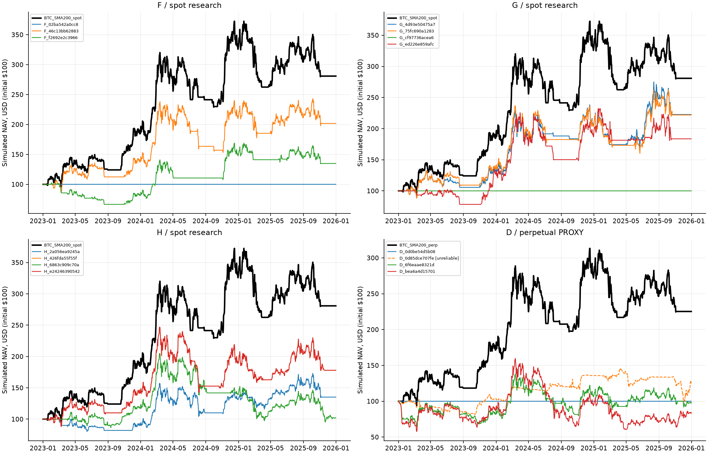
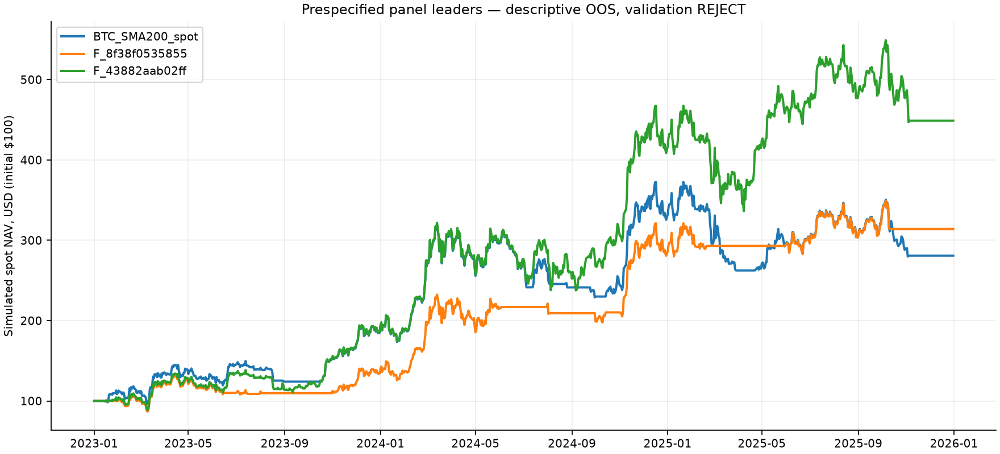
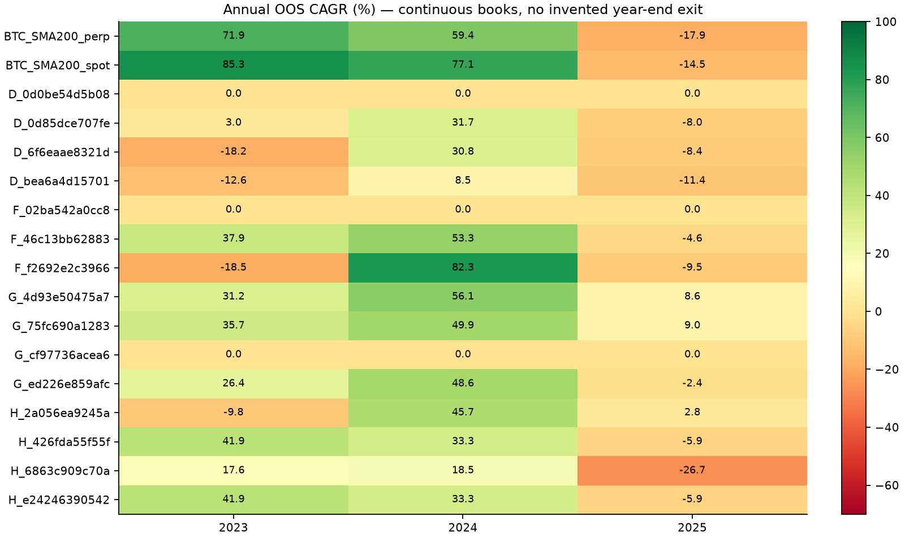
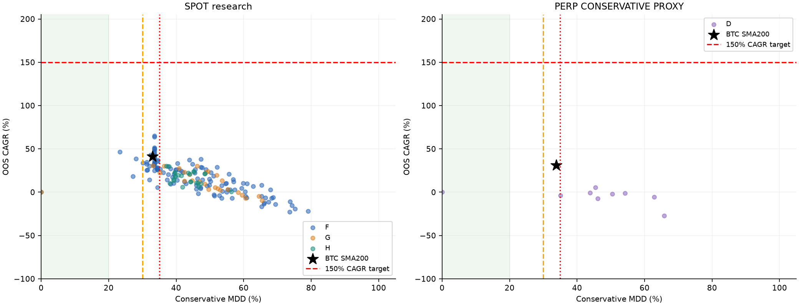

# TrendAtlas — pomalé trendy a režimy, 2026-09-27

**Verdikt: REJECT.** Žiadny zmrazený kandidát neprešiel všetkými cieľmi a stresmi. Výskum reálne prebehol. Žiadna stratégia nebola nasadená.

Zdroj: `58e308315d03a4561d53bbbd4019f7392f66e662`; vetva `codex/slow-trend-research-20260927`. Predchádzajúci experiment zostáva nezmenený. B/C sú archivované; žiadne ich mutácie. Primárny účet je simulovaných 100 USD, nie reálny stav účtu.

## A / B / C / D — rozhodnutie

- A, cieľ 150–200 % CAGR: NEEXISTUJE. Počet riadkov spĺňajúcich súčasne numerický cieľ v celom hlavnom OOS paneli: **0**.
- B, najlepší nominálny člen vopred zmrazeného panelu s MDD ≤25 % podľa Calmar/Sharpe: **F_8f38f0535855**. Je to opisný, validačne zamietnutý výsledok; nie robustný finalista ani nominácia na forward. Kvalifikovaný zmrazený finalista v tejto kategórii: **NEEXISTUJE**.
- C, platný kompromis s MDD≤35%, ktorý prešiel všetkými podmienkami okrem hlavného numerického cieľa: NEEXISTUJE.
- D: **REJECT** pre hlavný cieľ. Najvyšší CAGR medzi spoľahlivými zmrazenými finalistami: G_4d93e50475a7; tento údaj sám nie je odporúčanie.

Presné jednotlivé dôvody: [decision.json](results/decision.json), kategórie [decision_slots.json](results/decision_slots.json). Cieľ MDD 20 %, prijateľné 30 %, absolútne 35 %; Sharpe ≥1,5 a Calmar ≥4 zostali zachované. Nižšie riziková alternatíva nesmie byť označená za splnenie cieľa 150 % CAGR.

| ID / opisný panel | CAGR | MDD | Sharpe | Calmar | náklady USD | bez najlepšieho dňa | bez top 3 obchodov | development MDD | validation CAGR | validation gate |
| --- | --- | --- | --- | --- | --- | --- | --- | --- | --- | --- |
| F_8f38f0535855 | 46.43 % | 23.35 % | 1.24 | 1.99 | 5.86 | 41.72 % | 1.14 % | 58.84 % | -0.94 % | False |
| F_43882aab02ff | 64.94 % | 33.58 % | 1.33 | 1.93 | 1.10 | 58.88 % | 0.00 % | 55.58 % | -22.69 % | False |

**B: BTC 90-dňové momentum, mesačné vstupy**, bez potvrdenia a hysterézie, 1× spot, pri opačnom signále kauzálny exit. OOS má 46,43 % CAGR / 23,35 % MDD a 3/3 ziskové roky, ale development MDD bol 58,84 %, validation CAGR −0,94 % a bez troch najlepších celých obchodov ostáva iba 1,14 % CAGR. OOS Sharpe 1,24 a Calmar 1,99 sú pod cieľom.

**Najvyšší nominálny CAGR: BTC 120-dňový breakout, týždenné vstupy**, bez potvrdenia a hysterézie, 1× spot. OOS 64,94 % CAGR / 33,58 % MDD tvorí jeden uzavretý obchod trvajúci 1 017 dní; po jeho odobratí je CAGR prakticky nula. Development MDD bol 55,58 % a validation CAGR −22,69 %. Ani tento výsledok nesplnil kvalifikáciu.

Tieto dva panelové riadky sa po prezretí OOS nestali finalistami. Majú uložené pôvodné pravidlá, náklady, ročné foldy, koncentráciu a citlivosti deň/epizódy, ale **2× náklady, oneskorený fill, kapacita a susedia sú pre ne NOT_RUN**. Povinné úplné stresy boli určené a vykonané pre 15 finalistov zmrazených pred OOS. [Presná evidencia opisných lídrov](results/descriptive_panel_leaders.json). Žiadny robustný alebo agresívny kandidát nebol schválený.

## Časové oddelenie a zmrazenie

Warmup 2019; development 2020–2021; validation 2022; OOS 2023–2025; forward 2026 **neotvorený**. Každá fáza začína vlastným 100 USD účtom. OOS pokračuje cez tri roky s rovnakými pozíciami a pravidlami; ročné foldy sú rezy kontinuálnej knihy, nie fiktívne predaje 31. decembra. Ide o jeden zmrazený selection origin, nie každoročný refit. Historické OOS už bolo v starších fázach skúmané, preto nie je nové nedotknuté sealed obdobie.

[contract.json](contract.json), [protocol_freeze.json](protocol_freeze.json), [candidate_panel_frozen.json](candidate_panel_frozen.json), [engine_freeze.json](engine_freeze.json), [validation nominees](results/validation_nominees_frozen.json), [finalisti](results/finalists_frozen.json) dokumentujú poradie. Po OOS neboli žiadne mutácie. Zachované technické pokusy pred validation/OOS: [risk timing](attempts/pre_causal_risk_fix/attempt.json), [delay stress](attempts/pre_delay_audit_fix/attempt.json), [H schema](attempts/pre_H_schema_fix/attempt.json).

## Rodiny a spoločná tabuľka

| Family | OOS rows / reliable | CAGR range | min MDD | numeric target rows | decision |
| --- | --- | --- | --- | --- | --- |
| F | 121/119 | -22.97 % … 64.94 % | 0.00 % | 0 | REJECT |
| G | 28/26 | -9.31 % … 34.94 % | 0.00 % | 0 | REJECT |
| H | 26/25 | 0.73 % … 30.38 % | 37.14 % | 0 | REJECT |
| D | 17/9 | -28.71 % … 7.69 % | 0.00 % | 0 | REJECT |

Rozsah CAGR zahŕňa aj výslovne označené nespoľahlivé diagnostické riadky. MDD 0 % môže znamenať výlučne CASH a žiadnu obchodnú aktivitu; taký výsledok nie je alpha ani kvalifikovaná alternatíva. Najvyšší spoľahlivý nominálny CAGR v G je 30,58 %, v H 30,38 % a v D 5,41 %; žiadny z nich neprešiel validačným gate.

| ID | Track | reliable | CAGR | MDD | Sharpe | Calmar | turn/yr | cost USD | closed/open | median days | +folds | worst fold | 2× CAGR | delay CAGR | no best day | no top3 | max nominal test USD |
| --- | --- | --- | --- | --- | --- | --- | --- | --- | --- | --- | --- | --- | --- | --- | --- | --- | --- |
| BTC_SMA200_spot | spot | True | 41.07 % | 33.00 % | 1.04 | 1.24 | 10.65 | 15.59 | 16/0 | 3.50 | 2/3 | -14.50 % | 38.10 % | 38.10 % | 36.54 % | -2.70 % | 1000000.0 |
| BTC_SMA200_perp | perp | True | 31.08 % | 33.79 % | 0.86 | 0.92 | 10.73 | 63.30 | 16/0 | 3.50 | 2/3 | -17.90 % | 18.50 % | 28.12 % | 26.84 % | -3.82 % | 1000000.0 |
| D_0d0be54d5b08 | perp | True | 0.00 % | 0.00 % | 0.00 | 0.00 | 0.00 | 0.00 | 0/0 | 0.00 | 0/3 | 0.00 % | 0.00 % | 0.00 % | 0.00 % | 0.00 % | 1000000.0 |
| D_0d85dce707fe | perp | False | 7.69 % | 38.72 % | 0.44 | 0.20 | 15.05 | 12.89 | 79/7 | 21.00 | 2/3 | -8.00 % | -4.67 % | 11.50 % | 5.01 % | -7.65 % | 1000000.0 |
| D_6f6eaae8321d | perp | True | -0.64 % | 43.85 % | 0.21 | -0.01 | 6.23 | 24.72 | 8/1 | 103.00 | 1/3 | -18.18 % | -9.02 % | 0.97 % | -4.30 % | -19.41 % | 1000000.0 |
| D_bea6a4d15701 | perp | True | -5.62 % | 62.85 % | 0.18 | -0.09 | 10.32 | 30.73 | 10/1 | 63.00 | 1/3 | -12.63 % | -16.65 % | -4.77 % | -10.15 % | -29.71 % | 1000000.0 |
| F_02ba542a0cc8 | spot | True | 0.00 % | 0.00 % | 0.00 | 0.00 | 0.00 | 0.00 | 0/0 | 0.00 | 0/3 | 0.00 % | 0.00 % | 0.00 % | 0.00 % | 0.00 % | 1000000.0 |
| F_46c13bb62883 | spot | True | 26.35 % | 40.03 % | 0.78 | 0.66 | 4.00 | 3.83 | 6/0 | 160.00 | 2/3 | -4.61 % | 25.34 % | 25.29 % | 22.28 % | -3.19 % | 1000000.0 |
| F_f2692e2c3966 | spot | True | 10.46 % | 39.28 % | 0.47 | 0.27 | 5.33 | 3.36 | 8/0 | 57.00 | 1/3 | -18.45 % | 9.29 % | 10.17 % | 6.91 % | -14.21 % | 1000000.0 |
| G_4d93e50475a7 | spot | True | 30.58 % | 33.07 % | 0.88 | 0.92 | 4.37 | 4.60 | 13/0 | 119.00 | 3/3 | 8.64 % | 29.44 % | 30.29 % | 25.31 % | -0.94 % | 1000000.0 |
| G_75fc690a1283 | spot | True | 30.42 % | 36.44 % | 0.87 | 0.83 | 2.77 | 2.69 | 8/0 | 172.50 | 3/3 | 8.99 % | 29.70 % | 30.78 % | 25.16 % | 1.92 % | 1000000.0 |
| G_cf97736acea6 | spot | True | 0.00 % | 0.00 % | 0.00 | 0.00 | 0.00 | 0.00 | 0/0 | 0.00 | 0/3 | 0.00 % | 0.00 % | 0.00 % | 0.00 % | 0.00 % | 1000000.0 |
| G_ed226e859afc | spot | True | 22.44 % | 35.15 % | 0.70 | 0.64 | 5.44 | 5.14 | 22/1 | 34.50 | 2/3 | -2.36 % | 21.11 % | 19.75 % | 17.01 % | -10.01 % | 1000000.0 |
| H_2a056ea9245a | spot | True | 10.57 % | 38.11 % | 0.46 | 0.28 | 2.74 | 1.71 | 8/0 | 117.50 | 2/3 | -9.79 % | 9.98 % | 11.04 % | 6.28 % | -7.34 % | 1000000.0 |
| H_426fda55f55f | spot | True | 21.19 % | 48.42 % | 0.67 | 0.44 | 3.80 | 3.67 | 10/0 | 177.00 | 2/3 | -5.94 % | 20.19 % | 22.62 % | 16.23 % | -2.78 % | 1000000.0 |
| H_6863c909c70a | spot | True | 0.73 % | 56.33 % | 0.22 | 0.01 | 2.03 | 1.49 | 5/1 | 247.00 | 2/3 | -26.70 % | 0.35 % | 1.17 % | -3.29 % | -12.20 % | 1000000.0 |
| H_e24246390542 | spot | True | 21.19 % | 48.42 % | 0.67 | 0.44 | 3.80 | 3.67 | 10/0 | 177.00 | 2/3 | -5.94 % | 20.19 % | 22.62 % | 16.23 % | -2.78 % | 1000000.0 |

Tabuľka je OOS 2023–2025, rovnaké obdobie a 100 USD. Perp riadky sú **CONSERVATIVE_PROXY**; spot je samostatný výskumný track. Náklady sú kumulatívne skutočne účtované simulované doláre: fees+slippage+funding debits−credits. Turnover je jednostranný zobchodovaný notional/NAV za rok. MDD používa nepriaznivé intrabar extrémy; pri viacerých aktívach simultánne nepriaznivé ceny predstavujú konzervatívny bound. Najväčšia kapacita je iba najväčší spoľahlivý nominálny testovaný účet; nejde o živú certifikáciu venue ani interpoláciu. Veľký účet môže zostať čiastočne CASH: [capacity_fidelity.csv](results/capacity_fidelity.csv) preto osobitne ukazuje podiel požadovaného otvorenia, ktorý sa reálne vyplnil. Úplná tabuľka pridáva aj najväčší testovaný účet pri 95 % fill; ide o opisnú toleranciu, nie zmenu zmrazeného PASS gate. V CSV sú CAGR/MDD frakcie (0.35=35%).

Úplné riadky všetkých základov, finalistov a benchmarkov: [complete_comparison.csv](results/complete_comparison.csv). Vrátane explicitných príznakov reliability a benchmark gain/noninferiority; neúspešná diagnostická krivka nie je validovaný kandidát. [Každý ročný fold](results/annual_folds.csv), [všetky evaluácie](results/all_evaluations.csv), [Pareto front oddelene podľa venue tracku](results/pareto_front.csv), [kapacita 100–1m USD](results/capacity.csv).

BTC SMA200 bol znovu vypočítaný z konkrétneho BTC, nie načítaný zo starých ~30 % / 33 %. Spot OOS: 41.07 % CAGR / 33.00 % MDD; perp PROXY: 31.08 % / 33.79 %. Presný benchmark gate a rozdiely CAGR/MDD/Sharpe/Calmar/koncentrácie/foldov sú pri každom riadku, vždy s rovnakým trackom a obdobím. Kontextové nové prepočítanie za dlhšie obdobie 2022–2025: **spot: 29.45 % CAGR / 33.00 % MDD; perp: 22.51 % CAGR / 33.79 % MDD**. Rok 2022 bol v tomto benchmarku CASH; rozdiel CAGR teda vysvetľuje aj iný časový menovateľ. [Kontextový replay](results/benchmark_2022_2025_context.json).

## Presné pravidlá

F: samostatné SMA 50/100/150/200, dual 50/200, 100/200, 50/150, breakout 20/55/120/200, momentum 90/180/270/365 a dve vopred určené konjunkcie. BTC/ETH alebo päť likviditných slotov. G: BTC core s daným pomalým signálom; satelit 25/50/75 % v 1–2 likvidných altoch iba pri pozitívnom BTC aj vlastnom trende. H: top 2/3/5 podľa likvidity, vlastný absolútny signál, inverse-vol alebo covariance equal-risk. Záporné/chýbajúce sloty sú CASH; nie relatívny momentum víťaz. D: BTC signed regime, vlastné signed trendy, beta-neutral kladné/záporné trendy, funding-aware filter. D nepoužíva spot cenu na short ani na perp NAV.

Weekly znamená nedeľný dokončený close, monthly posledný deň mesiaca. Potvrdenie 0/3/7/14 po sebe idúcich dní, hysteresis ±0/1/3 %. Opačný potvrdený režim môže vyvolať denný exit; denné vstupy/rotácia povolené nie sú. Breakout používa predchádzajúce n-dňové maximum HIGH/minimum LOW, nikdy dnešné budúce high. Každý vstup prichádza až po dostupnosti signálu a latencii. Plné rovnice a canonical parameter schema: [contract.json](contract.json), implementácia [signals.py](signals.py).

| Finalista | Signál | Cadence | Potvrdenie dní | Symetrická hysterézia | Ďalšie aktívne pravidlá |
| --- | --- | --- | --- | --- | --- |
| D_0d0be54d5b08 | breakout200 | monthly | 7 | 0.00 % | top_k=1, inverse_vol; own_trend_ls; gross=1.0 |
| D_0d85dce707fe | sma200 | weekly | 7 | 0.00 % | top_k=5, inverse_vol; beta_neutral; gross=1.0 |
| D_6f6eaae8321d | sma200 | monthly | 7 | 0.00 % | top_k=5, equal; btc_regime; gross=1.0 |
| D_bea6a4d15701 | sma200 | weekly | 7 | 0.00 % | top_k=5, equal; btc_regime; gross=1.25 |
| F_02ba542a0cc8 | breakout120 | monthly | 3 | 3.00 % | scope=BTC |
| F_46c13bb62883 | sma200 | monthly | 3 | 0.00 % | scope=BTC |
| F_f2692e2c3966 | combo_breakout_mom | monthly | 0 | 0.00 % | scope=BTC |
| G_4d93e50475a7 | sma150 | monthly | 3 | 0.00 % | satellite=0.5, k=1 |
| G_75fc690a1283 | sma150 | monthly | 7 | 1.00 % | satellite=0.5, k=1 |
| G_cf97736acea6 | breakout200 | weekly | 7 | 3.00 % | satellite=0.75, k=1 |
| G_ed226e859afc | combo_sma_mom | weekly | 14 | 0.00 % | satellite=0.75, k=2 |
| H_2a056ea9245a | combo_breakout_mom | monthly | 14 | 3.00 % | top_k=2, inverse_vol |
| H_426fda55f55f | sma200 | weekly | 7 | 0.00 % | top_k=2, equal_risk |
| H_6863c909c70a | dual100_200 | monthly | 7 | 0.00 % | top_k=2, inverse_vol |
| H_e24246390542 | sma200 | weekly | 7 | 0.00 % | top_k=2, inverse_vol |

Úplné canonical konfigurácie vrátane mapovania oboch evolučných vetiev a všetkých troch výberových slotov: [finalists_frozen.json](results/finalists_frozen.json). Všetkých 184 pravidiel panelu bolo uložených v [candidate_panel_frozen.json](candidate_panel_frozen.json) pred výpočtami.

## Ablácie, náklady a stresy

[component_ablations.csv](results/component_ablations.csv) obsahuje1170 presných jednoparametrových porovnaní zmrazeného základného panelu, vrátane BTC core→default satelitu tam, kde sa ostatné pravidlá zhodujú. Záporná delta MDD je zlepšenie. Nie je to post-OOS optimalizácia. [overlay_ablations.json](results/overlay_ablations.json) obsahuje iba overlaye základov, ktoré samostatne prešli development+validation gate; počet eligible základov: 0. Ak žiadny neprešiel, stop/trailing/TP boli správne NOT_RUN, nie predstierané zlepšenie alphy.

Každý zmrazený finalista má 2× fees/slippage/funding **debits** (credits sa nezdvojnásobujú), oneskorenie o jeden vykonateľný 4h bar, odstránenie najlepšieho portfolio dňa, odstránenie troch najlepších celých uzavretých epizód, všetkých povolených susedov, koncentráciu, ročné foldy, expozíciu a dolárové náklady. [Stresy](results/stresses.csv), [susedia](results/neighbors.csv), [asset/episode koncentrácia](results/concentration.csv), [presná expozícia vrátane driftu](results/exposure.csv), [dolárové náklady za každý rok](results/dollar_costs.csv), [otvorené pozície](results/open_positions.csv). Otvorená epizóda nie je fiktívne uzatvorená, preto sa nepočíta medzi tri ukončené obchody; jej hodnota a koncentrácia zostávajú reportované. Odobratie dňa/epizód je citlivosť presného log-PnL účtu, nie nový obchodovateľný backtest; ich drawdown je close/bar-based, nominálny MDD zahŕňa intrabar bound.

D navyše prešiel maintenance 5/10/20 %, nepriaznivou mark neistotou 0/1/3 %, nulovými funding credits a dodatočným 10 % pa gross debitom. Maržová blízkosť <3× maintenance alebo breach sa označí a spôsobí REJECT; ochranný exit čaká na publikáciu baru a skutočnú exekúciu, nezachráni spätne stratu. Reálny vstupný gross strop je 1/1,25; medzi fillmi môže trhový pohyb spôsobiť drift, preto sa neeviduje fiktívne kontinuálne rebalansovanie.

## Venue, PIT a zvyšky

Historický census obsahuje všetky archívne USDT rizikové spot symboly vrátane zaniknutých. Každý deň treba 365 pozorovaných dní a 30-dňový priemerný quote objem ≥10m USD; portfólio používa najviac päť takto dostupných identít CELKOVO. BTC/ETH samostatné vetvy rešpektujú warmup a likviditu, nepotrebujú top5 rank. Ticker reuse má oddelené epochy. Prvé/posledné ceny sú pozorované dátumy, nie predstieraná úplná administratívna certifikácia. Známe notices sú publication-aware. [PIT membership](pit_membership.csv), [data audit](data_audit.json), [acquisition universe](acquisition_universe.json).

F/G/H účtujú Binance spot; D skutočné Binance USD-M trade/mark/funding. Pri chýbajúcom mark sa používa cena toho istého PERP s výslovným PROXY označením a nepriaznivým mark stresom. Chýbajúca cena držaného aktíva sa nevyplní nulovým výnosom do rankingov: zostáva stale valuation príznak; nad 24h reliability zlyhá. Funding je timestamped, notional používa posledný dostupný vlastný mark, nie neskorší close. Historické margin/fee/lot/listing dôkazy nie sú kompletné; žiadny venue-certified výsledok sa nevyhlasuje.

Základné fees 10 bps a slippage 10 bps sú konzervatívne proxy predpoklady; spot funding 0, perp skutočné signed udalosti. Participation 0,1 % posledného publikovaného quote objemu, entry TTL 6 / exit TTL 18 barov. Nevyplnený zvyšok sa nezmení na fill: ostáva množstvo+MTM. Min-order dust sám neinvaliduje celý výsledok. Celé nevyplniteľné materiálne exity sú osobitný reliability problém. Pri konci OOS sa pozície nepredávajú fiktívne.

Hyperliquid vlastná dokumentácia potvrdzuje 10 USD minimum a 4,5 bps základný perp taker; szDecimals a ceny majú vlastné pravidlá. Binance minimum nebolo označené za Hyperliquid pravidlo. [Primárne zdroje](sources.json). Súčasné HL parametre ani Binance ceny nemôžu certifikovať historické HL plnenie; výskum používa výslovne oddelené proxy tracky. Presné historické lot/tick pravidlá nie sú známe: základná fractional precision a samostatný hrubší 1 USD target-quantity stress sú modelové predpoklady. Výsledky nie sú povolenie na živý 100 USD účet.

## DeepSeek oproti deterministickej vetve

Reálne API volania spolu: **12**, tokeny **19159**, odhad ceny **$0.004545**, konzervatívne rezervované maximum$0.049747. Prijaté návrhy43, odmietnuté5. Podrobné dôvody, schéma, payloady a usage: [designer_events.jsonl](results/designer_events.jsonl). Kľúč sa neukladá. Cena je odhad podľa oficiálneho cenníka, nie faktúra.

Každá rodina a arm má 10 počiatočných kandidátov, 6 Pareto survivors, 4 mutácie v troch ďalších generáciách: 22 budget slots, spolu 176. Spoločné konfigurácie sa počítajú raz a cache sa zdieľa, budget armov sa tým nemení. Jediný vážený fitness súčet neexistuje. Samostatný 184-členný panel je rovnaký pre oba army a nevstupuje do mutácií. Môže preto viesť k identickému finalistovi oboch armov; to nie je dôkaz prínosu AI. [arm_comparison.csv](results/arm_comparison.csv) ukazuje samostatné search výsledky a validation úspešnosť.

V každej z ôsmich vetiev (4 rodiny × 2 návrhári) bolo vyhodnotených 22 kandidátových slotov. **Žiadny zo šiestich konečných survivorov ani jednej vetvy neprešiel development + validation kvalifikáciou. Prínos DeepSeek oproti deterministickým mutáciám sa preto v tomto experimente nepreukázal.** Vyšší izolovaný development CAGR nie je úspech OOS ani dôvod meniť výber.

Prvý technický pokus bol zastavený počas development po 9 API volaniach. F/G payloady sa pri opakovaní museli presne zhodovať. Tri H volania zostávajú pôvodné development-only hypotézy: po oprave validátora bol equal-notional návrh odmietnutý, povolené návrhy znovu validované a chýbajúce nahradené deterministicky. Pri H sú uložené pôvodné API payloady aj nové verification payloady, výslovne označené ako neodoslané API. Ďalšie opravy pred validation/OOS sa týkali publikácie ochranných perp risk signálov, explicitného gross limitu a delay stresu týchto príkazov. Pôvodná evidencia všetkých prerušených pokusov je zachovaná; nové D volania sa zmestili do pôvodného celkového limitu 12. Žiadna oprava ani hypotéza nevychádzala z validation/OOS výsledkov. Opakované technické výpočty nie sú ďalšie kandidátové budget slots.

## Reprodukcia a audit

Pozri [README.md](README.md) pre úplné offline príkazy bez nového účtovania API a [AUDIT.md](AUDIT.md) pre FILES READ, SOURCE OF TRUTH, presnú príčinu/kontrakt, regression tests, forbidden-old-path kontrolu a git add zoznam. Výsledkové ZIPy obsahujú denne NAV, účtované dolárové náklady, objednávky, fill lineage a epizódy; primárni finalisti a stresy navyše všetky 4h stavy/množstvá. Žiadny merge, deploy, Pi príkaz ani živá objednávka.
